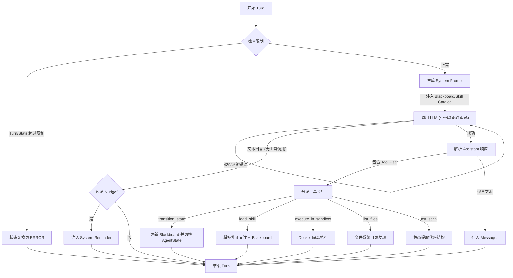
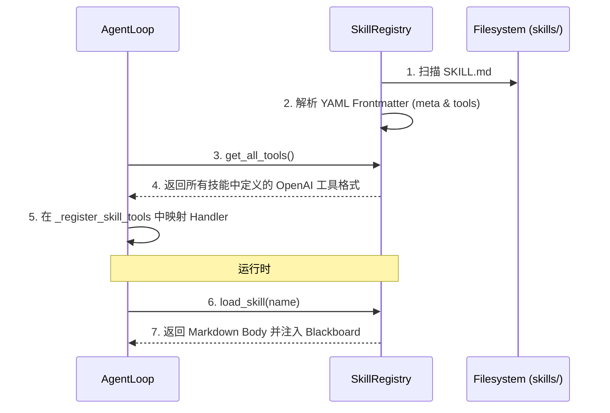
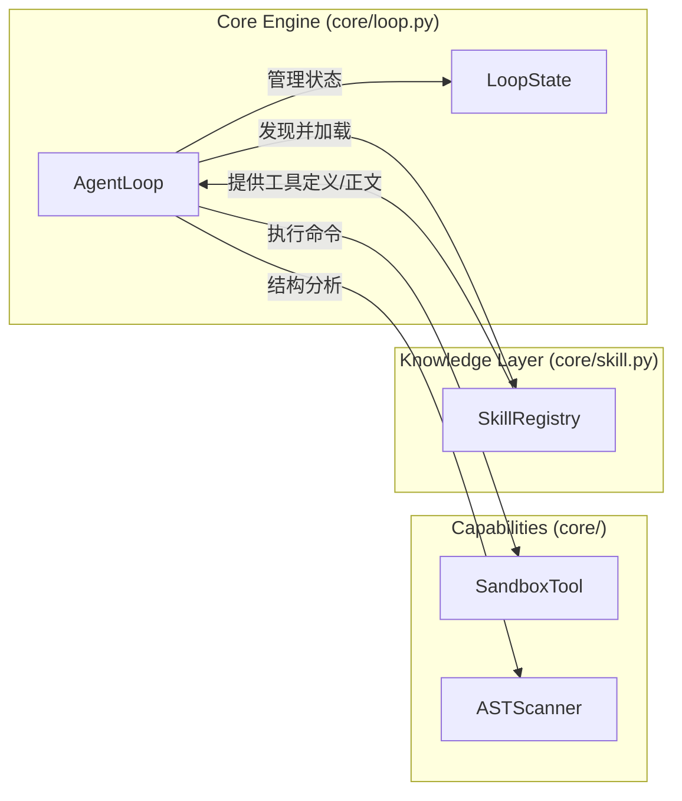

# Sec-Agent-Harness: 模块级详细架构图 (Granular Module Architecture)

本文档将系统拆解为三个核心子系统：**FSM 运行引擎**、**自动化侦察与执行 (Sandbox/AST)** 和 **动态技能生命周期管理**。

---

## 1. FSM 运行引擎详解 (`core/loop.py`)

本模块负责 Agent 的决策与执行循环，并集成了 API 韧性机制。

### 1.1 `run_one_turn` 执行流程 (Flowchart)

---

## 2. 自动化侦察与安全执行

### 2.1 Docker 隔离沙箱 (`core/sandbox.py`)
- **设计目标**：确保 PoC 验证和回归测试在受限、不可恢复的环境中运行。
- **核心特性**：
    - **资源控制**：限制 CPU 份额和内存上限。
    - **网络截断**：默认禁用网络，防止数据外泄或反弹 Shell。
    - **权限隔离**：强制以非 root 用户 (`1000:1000`) 身份运行。
    - **容错初始化**：如果 Docker 未就绪，系统会降级并记录警告，而非终止运行。

### 2.2 AST 静态分析器 (`core/ast_utils.py`)
- **设计目标**：在不读取全量文件内容的情况下，快速映射项目结构。
- **能力**：
    - 提取类定义及其方法。
    - 提取顶层函数及参数列表。
    - 分析模块导入依赖。

---

## 3. 动态技能与工具注入 (`core/skill.py`)

本模块不仅负责知识加载，还负责 **工具定义的动态发现**。

### 3.1 技能与工具生命周期 (Lifecycle)

---

## 4. 跨模块交互总结 (Interaction Map)

---
*上次更新: 2026-04-15*
---
