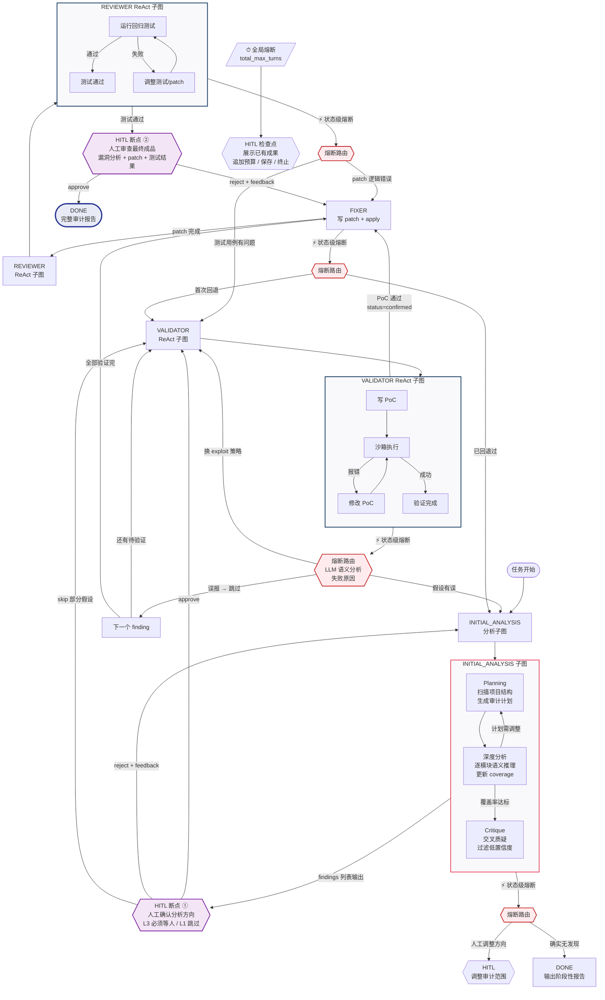
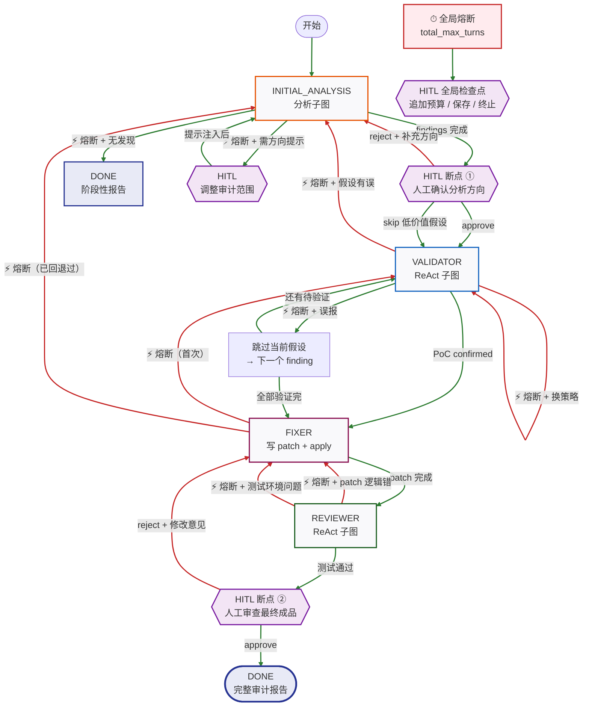
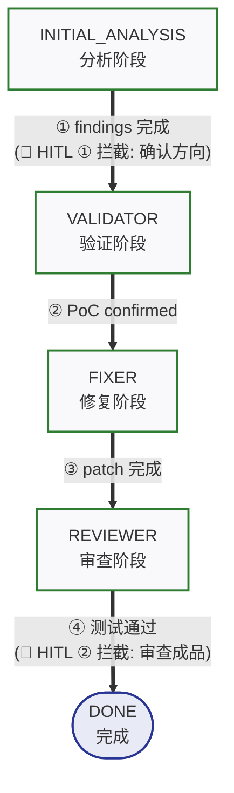
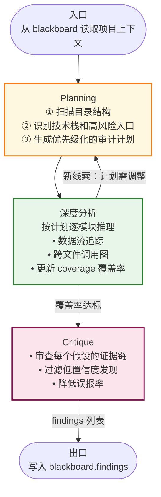
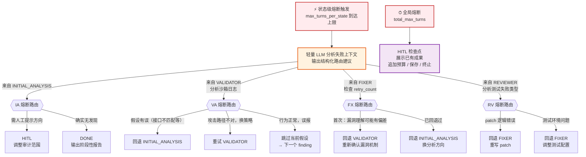

# Sec-Agent-Harness 面试准备文档

---

## Part 1：项目简介（~1min）

> 使用场景：面试官说"介绍一下这个项目"时的开场白，讲清楚**是什么、解决什么问题、怎么解决的**。

这个项目是一个面向安全审计的自主 Agent 系统。起点是我们已经有一个多 Agent 协作的审计系统，但在实际跑长链路任务时遇到了三个核心问题：LLM 自主控制状态流转时经常跑偏或卡死、长对话导致早期的关键线索丢失、以及工具调用死循环和越权。

为了系统性地解决这些问题，我从零设计了一套**图驱动**的 Agent 引擎。整体架构是把审计流程建模为一张**有向图**——每个节点是一个阶段（分析、验证、修复、审查），每条边定义了阶段间的**流转条件**（比如"沙箱测试通过才进入修复"）。在此基础上，我设计了结构化的 State 管理，配合增量更新和三级上下文压缩来解决长链路的 Token 爆炸问题；以及一套 Skill 体系，把安全分析能力通过渐进式按需加载的方式提供给 Agent。

---

## Part 2：详细介绍（~5min 引导式陈述）

> 使用场景：面试官让你"详细讲讲"时的展开版本。按 **问题→架构→State→Skill** 四段递进，每段末尾自然留钩子引导追问。

### 一、项目概述与设计重点（~1min）

这个项目是一个面向安全审计的自主 Agent 引擎。起点是我们已经有一个多 Agent 协作的审计系统，但在跑长链路任务时成功率不到一半。我从零重新设计了整套引擎，核心围绕三个设计点展开：

第一个是**控制流设计和管理**。问题是原来让 LLM 自己决定什么时候切换阶段，模型经常**跑偏**，或是**不稳定**——分析没做完就跳到修复，或者验证失败了不回退。解决方式是把审计流程建模为一张有向图：节点是阶段（分析→验证→修复→审查），边定义了流转条件。边分为两类：一类是**客观结果驱动**（比如"沙箱测试通过才进入修复"），由引擎自动路由，LLM 不参与；一类是**语义驱动**，比如模型在验证过程中发现漏洞根本不可利用，可以主动触发短路信号提前退出，不用等轮次耗尽才回退。在此基础上配合双层熔断防止死循环、HITL 断点在高危操作前等人工审批，模型只专注于每个节点内的语义推理。

第二个是**信息传递和上下文管理**。审计经过上百轮对话后，会出现 Token 占用过大、上下文过长等问题，同时各阶段之间也可能出现信息链断裂，因此设计高效的信息传递和上下文管理机制尤为重要。解决方式是设计了一套结构化的 State 管理体系：State 分为工作记忆（当前轮对话）和持久记忆（跨阶段共享的领域数据）。阶段切换时工作记忆被清理，但关键结论会结晶到持久记忆中保留下来——这样持久记忆始终承载着审计的核心发现，而工作记忆保持精简不会无限膨胀。同时配合多级压缩对 State 的不同部分逐层控制体积（工作记忆清理、持久记忆归档、工具输出截断），以及 Checkpoint 做状态快照保证崩溃可恢复。核心原则是"**结晶优于存储**"——不保留上百轮原始对话，只保留提炼出来的关键结论。

第三个是**工具调用与知识积累**。安全审计需要大量专业的静态分析能力（SQL 注入检测、污点追踪等），全部塞进上下文会挤爆 Token。解决方式是用 Skill 插件体系做渐进式按需加载——System Prompt 只放一行目录摘要，模型按需展开具体 Skill 的工作流和参考文档。在做污点分析 Skill 的过程中，我发现它的规则天然需要不断积累更新：每个项目有自己的安全函数、自定义 sink、特殊的封装层，这些都是通用规则库覆盖不到的。这启发我设计了一套**知识自进化机制**——Agent 在审计过程中发现的项目特有知识（比如"这个函数是安全的 sanitizer"）会通过反思模块结晶为持久化的规则，下次审计时自动加载。经过 2-3 轮迭代，Agent 从"通用扫描器"进化为"这个项目的专属安全专家"。

下面我按这三个设计点展开讲。

### 二、工作流引擎设计（~1.5min）

前面提到把审计流程建模为有向图，这里展开讲节点内部的设计。每个节点内部可以是简单的 ReAct 循环（模型思考→调用工具→观察结果→继续思考），也可以是更复杂的**子图**。比如验证阶段需要多轮"写 PoC → 跑沙箱 → 看报错 → 改 PoC"的迭代，我把它封装成独立的 ReAct 子图，子图有自己的工具集、模型配置和轮次限制，内部状态自行管理，只把最终结果交还主图；分析阶段则是一个多阶段子图（规划→深度分析→交叉质疑），内部有自己的流转逻辑。同样的子图模式在验证和审查阶段复用。节点之间的流转由引擎根据客观结果自动完成——比如"沙箱退出码为 0 → 进入修复"、"测试失败 → 回退到分析"。

核心设计原则是**确定性计算交给代码，语义推理交给模型**。引擎负责"走哪条边"的决策，模型负责每个节点内"怎么分析代码、怎么写 PoC、怎么生成补丁"的语义工作。这样模型不需要操心"现在该到哪一步了"，流程控制的可靠性也不再依赖 LLM 的一致性。

安全保障做了三层：**权限隔离**——每个节点有独立的工具可见集，沙箱执行只对验证和审查可见，分析阶段的模型根本看不到这个工具；**双层熔断**——全局有总轮次上限，每个状态内部也有独立的轮次限制，防止死循环；**HITL 断点**——高危操作前（比如 FIXER 写文件、最终报告输出）暂停等人工审批，审批通过才恢复执行。


> 🪝 *钩子*：这里可以留一句"控制流确定了之后，接下来最大的挑战其实是 State 管理"，引导面试官追问第三段。

### 三、State 管理与上下文压缩（~1.5min）

控制流确定之后，最大的挑战变成了 **State 管理**。这里有两个看似矛盾的问题：一是**跨阶段的知识传递**——分析阶段发现的关键线索怎么保证在修复阶段还能被模型看到；二是**Token 持续膨胀**——上百轮对话加上工具返回会撑爆上下文窗口。要传递知识就得保留信息，但保留太多又会膨胀——所以核心设计原则是"**结晶优于存储**"：不保留原始对话过程，只保留提炼出来的关键结论。

有效的跨阶段传递主要依赖如何对信息进行结构化的保留，我为此设计了 **Blackboard** 作为结构化共享状态。它的 Schema 是按审计流程的阶段间交接需求定制的。举个例子，分析阶段写入的每条漏洞假设不只是一句描述，而是包含：定位信息（文件路径、函数名、代码片段）让验证阶段能直接定位目标代码；攻击假设和推理证据链，让验证阶段理解用什么向量写 PoC、为什么怀疑这里有问题；以及置信度分级（suspected / likely / confirmed），让后续的 Critique 环节可以按置信度过滤低价值假设，避免浪费验证资源。验证阶段则回填 PoC 执行结果（退出码、沙箱日志、实际攻击向量），修复阶段据此选择修复策略和生成 patch。阶段切换时对话历史（工作记忆）被清理，但这些结构化结论已经结晶在 Blackboard（持久记忆）里不会丢。多轮写入会有一致性问题（比如两轮分别发现的漏洞，简单赋值会互相覆盖），所以更新通过 **Reducer** 做归约合并：findings 用追加语义，阶段总结用覆写语义，合并策略固化在代码里，模型只管写数据。

Token 膨胀靠**三级压缩**逐层控制：L1 是状态切换时清理工作记忆只保留 Blackboard 结晶；L2 是 Blackboard 本身超阈值时归档旧摘要和过期 Skill 缓存；L3 是对大体积工具输出按类型做截断。配合 **Checkpoint** 机制在关键节点做状态快照，即使审计中途 API 超时也能从最近的 Checkpoint 恢复继续。


> 🪝 *钩子*：留一句"State 解决了知识传递的问题，但安全审计还需要很多专业的静态分析能力，这就引出了 Skill 体系"。

### 四、Skill 插件与知识架构（~2min）

最后一块是 Skill 体系。这里要解决两个问题：一是安全审计需要大量专业能力（SQL 注入检测、污点追踪、回归测试等），如果全部硬编码在引擎里，每新增一种分析能力都要改引擎代码；二是这些能力的描述和参考文档全部塞进上下文会挤爆 Token。

设计理念是 **"Codify, Don't Prompt"**——如果一个任务包含明确的步骤和领域知识，不要指望 LLM 每次都凭提示词自发正确执行，而是固化为独立的、可版本控制的 Skill 模块。Prompt 是临时的、脆弱的；Skill 是模块化、可重用、可被 Git 管理的程序化知识。

每个 Skill 内部采用 **META-REFERENCES-ASSETS 三层知识架构**，解耦"何时用"、"怎么用"和"用什么资源"：META 层是 Skill 的入口（YAML 元数据 + 执行指南），告诉模型在第几步应该去读哪份资料；REFERENCES 层存放按需查阅的深度文档（代码规范、Checklist、Case Studies）；ASSETS 层是静态资源（危险函数列表等）。加载策略是**渐进式按需展开**——System Prompt 只放一行 Skill 目录摘要，模型按需调用 `load_skill` 加载 META 层的执行指南，再在工作流的特定步骤读取 REFERENCES 层。这样即使有 20 个 Skill，模型在任何时刻只加载当前需要的那一个。

更重要的是 **Skill 自进化机制**。传统静态分析工具是无状态的——每次扫描带着通用规则来，扫完就走。但安全审计中，每个项目都有自己的安全函数、自定义 sink、特殊的封装层，通用规则库覆盖不到。自进化让 Agent 能从自己的失败和成功中学习，并把经验结构化地写回 Skill。

触发时机是**信息增益最高的时刻**：比如验证阶段 PoC **反复失败后**模型找到了正确的攻击路径，这条"失败→成功"的路径中蕴含着 Skill 没覆盖的知识；或者 Critique 阶段连续标记多个误报且原因相似（比如模型反复把框架内置的 sanitization 误判为不安全），这意味着当前的 Checklist 有盲区需要补充。触发后引擎启动一个**反思阶段**——调用 LLM 对执行链做分析："你在哪一步偏离了最优路径？这个教训是否通用？"，输出结构化的修改建议（新增 Checklist 项、更新反模式约束等），自动生成对 Skill 文件的 diff。

经过 2-3 轮迭代后，Agent 从"通用扫描器"进化为"这个项目的专属安全专家"——误报率大幅下降，因为它"认识"了项目的自定义抽象层。但自进化也有风险——一次错误的规则沉淀可能污染后续所有审计（比如误将 `mark_safe()` 标记为安全函数，导致整类 XSS 漏洞被漏报）。所以安全护栏是**机器提议，人类审批**：所有修改自动提交为 Git PR 而非直接写入，每个 Skill 维护一套回归测试基准（代码片段→预期结果的映射），PR 合并前必须通过全部回归测试——新规则不仅自己要 pass，还不能破坏已有的几百个"以前能正确处理的场景"。

要让 Agent 真正成为项目的专属专家，它需要积累三类知识：**确定性的判定规则**（哪些函数是安全的 sanitizer、哪些是自定义的危险 sink）、**语义性的架构认知**（项目的整体架构模式、历史审计中踩过的坑），以及**当前审计的工作状态**（正在追踪的线索和中间结论）。这三类知识的查询方式完全不同，所以存储也做了分层：判定规则存为 JSON 文件供工具做确定性查找；架构认知和历史教训存在 SQLite FTS5 中做语义检索；工作状态在 Blackboard 里，session 结束后通过结晶流写入前两层。


---

## Part 3：技术要点深挖 Q&A

以下为简历中所有可被面试官追问的技术锚点，每个要点采用总分结构：
- 总述（核心回答）
- 分述（展开细节）
- **改进方向**（讲述与当前实现进展之间的差距）
- **拓展思考**（设计权衡与反思）
- **面试官可能的追问**（附回答要点）

> **撰写原则**：
> 1. 每个技术点需要**举具体场景/例子**说明必要性，不能只讲抽象设计
> 2. 整体讲述**不局限于当前代码现状**，在合理范围内可以超前设想，怎么讲得好怎么写

#### 系统全局流程图



**图 1：主状态机（完整状态转移）**



**附图 1-1：主线控制流与 HITL 拦截机制（极简主干视图）**

> 配合图 1 讲解。图示仅保留主干的五个流转阶段（Happy Path），去除了所有异常回退与熔断分支。同时将 HITL 降维并附加在转移边的文字上（作为拦截点），从而呈现出最纯粹、线性的审计骨架。



**图 2：INITIAL_ANALYSIS 内部子图**



**图 3：熔断与回退路由**



### 3.0 问题背景与发现过程

在已有审计系统上跑长链路任务时，通过观察 Agent 运行日志发现了状态流转错乱、关键线索丢失、工具调用失控三类反复出现的失败模式。

我们原来的系统是让 LLM 通过调用一个 `transition_state` 工具来自主决定什么时候切换阶段。跑了一批测试用例之后，我翻日志发现了几种典型的失败模式：

1. **状态流转错乱**：模型在分析阶段还没完成就提前调了 transition 跳到修复，或者反过来在该退出的时候忘了调导致一直空转。这在对话超过 20 轮之后尤其频繁，因为模型对"我现在在哪个阶段"的感知随着上下文增长逐渐模糊。

2. **关键线索丢失**：比如分析阶段花了很多轮推理出"这个 `transfer` 函数没做 reentrancy guard"，但等到修复阶段时这条线索已经被更多的对话内容挤出了上下文窗口，模型开始从零分析或者修错位置。

3. **工具调用失控**：模型对同一个文件反复 `read_file`，或者在不需要跑沙箱的阶段调了 `execute_in_sandbox`。

这些不是偶发问题，而是 LLM 做长链路任务时的系统性缺陷。从模型层面看，Transformer 的注意力在长上下文中会被稀释（lost-in-the-middle 现象），中间位置的信息检索能力显著下降；同时模型本身没有持久化记忆机制，所有状态感知完全依赖上下文窗口内的文本。从任务层面看，模型同时承担"执行任务"和"管理自身流程"两个角色，随着复杂度上升两边都会退化。

**拓展思考**：这个发现本身影响了我后续的整体设计哲学——**不要让 LLM 做它不擅长的事**。LLM 擅长推理、生成、分析代码，但不擅长维护状态、遵守流程、控制自己的行为边界。所以架构上的核心思路就是把这些"元控制"能力抽离出来交给确定性代码。

**面试官可能的追问**：
- "你跑了多少用例才发现这些模式？有没有做过量化分析？"
  - → 跑了一批漏洞靶场的 challenge，每个 challenge 都有完整的运行日志。没做严格的量化统计，但三类问题出现的频率大概是：状态流转问题最多（约一半以上的失败 case），其次是上下文丢失，死循环相对少但一旦发生就彻底卡死。
- "LLM 对自身阶段感知模糊，你尝试过通过 Prompt 优化来解决吗？效果如何？"
  - → 试过，在 System Prompt 里加了"你当前在 XXX 阶段，请专注于 XXX"的提示，短链路有效，但超过 20 轮后模型依然会忽略。Prompt 是软约束，解决不了根本问题，所以最终选择了架构层面的硬约束。
- "这些问题在不同模型（GPT-4 vs Claude）上表现一致吗？"
  - → 表现形式不同但问题本质一致。Claude 在指令遵循上更好一些，状态流转出错率稍低，但上下文丢失和死循环问题同样存在。这说明问题不在某个模型的能力上，而是 LLM 做长链路自主控制的结构性局限。

### 3.0.1 为什么从零设计而不直接用 LangGraph

项目启动时 LangGraph 还不成熟，而且我们的需求是深度定制审计流程，不是通用的 Agent 框架能直接套用的。实际的开发路径是：先遇到问题 → 手搓 FSM 引擎解决 → 后来调研 LangGraph 发现设计方向一致 → 引入它的部分思想（Reducer、Checkpoint）做架构演进。

2. **集成复杂度**：LangGraph 的 State 本身是可以自定义的，但我们的定制需求不只是 State 结构——还包括节点级的工具权限分发、每轮 Prompt 的动态组装逻辑、Skill 的生命周期管理、上下文压缩的触发策略等。这些行为需要深度嵌入引擎的主循环，用通用框架做这些胶水层的定制反而增加复杂度。
3. **理解深度**：从零实现让我对 Agent 系统的每个环节（状态管理、工具分发、上下文生命周期）都有代码级的掌控力，后来引入 LangGraph 思想时能精准判断哪些概念适合我的场景。

**拓展思考**：这其实是"用框架 vs 造轮子"的经典权衡。我的立场是：核心调度逻辑自己掌控，上层能力（如 Checkpoint 持久化）可以借鉴成熟方案。这样既有定制灵活性，又不会在架构设计上走弯路。

**面试官可能的追问**：
- "现在回头看，如果重新来过你会直接用 LangGraph 吗？"
  - → 如果项目目标是快速出 MVP，会考虑。但对于需要深度定制工作流和工具权限控制的场景，自研引擎 + 借鉴框架思想仍然是更合适的路径。LangGraph 更适合标准化的 Agent 场景。
- "你借鉴了 LangGraph 的哪些具体思想？"
  - → 主要三个：Reducer 归约模式（统一状态合并语义）、Checkpoint 持久化（节点级快照）、以及条件边路由的声明式定义方式。没有直接依赖它的 SDK，而是把这些设计模式融入自己的引擎。

### 3.1 条件边路由与确定性控制流

节点间的流转完全由条件边路由驱动，基于工具返回的客观结果自动路由至下一阶段，LLM 不参与控制流决策。

之前的实现是让模型调用 `transition_state` 工具自主决定切换，但模型在长对话中对"该不该切"的判断会退化。改为条件边后，控制流变成确定性的——相同的 State 一定产生相同的路由结果，可测试、可回溯。

具体来说，路由逻辑集中在 `transition_handler` 函数中，每轮 LLM 返回后检查 State 中的标志位（如 `blackboard["last_test_status"]`），通过条件判断下一个状态。路由条件是基于业务语义设计的：比如 VALIDATOR 测试通过才进入 FIXER，失败则回到 INITIAL_ANALYSIS 重新分析；REVIEWER 测试通过才能标记 DONE，否则退回 FIXER。

在我的系统里，确定性和不确定性的边界大致是这样的：
- **确定性路由**：沙箱退出码决定测试是否通过、熔断计数器触发超时退出、`mark_as_done` 标记完成进入下一阶段——这些都有明确的客观判据，适合代码控制。
- **不确定性决策**（目前仍由 LLM 处理）：分析阶段判断"这个函数是否存在漏洞"、验证阶段决定"PoC 应该用什么攻击向量"、修复阶段选择"用哪种修复策略"——这些需要领域推理，交给模型做。

**拓展思考**：确定性路由解决了控制流可靠性问题，但也牺牲了灵活性——比如分析阶段模型判断"这个漏洞没有修复价值，建议跳过"，这种语义性决策目前无法表达。未来可以区分**结构性路由**（确定性，代码控制）和**语义性路由**（不确定性，LLM 决策），两者共存。

**改进方向**：

当前 INITIAL_ANALYSIS 是一个扁平的 ReAct 循环，模型自由探索代码然后输出漏洞假设。问题在于：面对大型项目时，模型没有全局视角，容易陷入局部文件反复阅读，分析覆盖率不可控，也无法保证分析的系统性。

改进思路是把 INITIAL_ANALYSIS 从扁平的 ReAct 循环升级为一个**多阶段分析子图**，内部包含三个阶段：

1. **Planning 阶段**（子图内第一阶段）：Agent 先用工具扫描项目结构、识别技术栈和关键入口点，生成一份结构化的审计计划——哪些模块高风险、用什么策略分析、优先级如何。之所以不把 Planning 作为主图的独立节点，是因为它和分析本身是紧耦合的：计划需要随分析进展动态调整，比如发现了一个可疑的跨模块调用后需要追加新的分析任务。放在子图内部可以让 Planning 和 Analysis 在同一个状态空间里迭代。

2. **深度分析阶段**（子图内第二阶段）：按照计划逐模块分析，Agent 结合 AST 工具做数据流追踪、跨文件调用图构建等传统工具做不到的语义推理。每分析完一个模块就在 blackboard 中更新覆盖率和发现列表。

3. **Critique 阶段**（子图内第三阶段）：分析结果在进入主图的 VALIDATOR 之前，先经过一轮自我质疑——审查每个漏洞假设是否有充分的证据链，过滤掉低置信度的发现，降低误报率。

子图的退出条件是确定性的：覆盖率达标 + Critique 完成 → 输出漏洞假设列表 → 主图路由到 VALIDATOR。

进一步地，子图内部的三个阶段是否应该用 Multi-Agent 来实现，而非共享同一个上下文的单 Agent：

- **核心矛盾**：如果 Planning、深度分析、Critique 共享上下文，分析阶段读取大量代码后上下文已经拥挤，Critique 的推理质量会下降；而且 Critique 看过完整分析过程后容易产生确认偏误，降低质疑的有效性。
- **Multi-Agent 方案**：每个阶段启动独立的 Agent 实例（独立上下文窗口），通过 blackboard 做结构化交接——Planning 输出审计计划、Analysis 输出发现列表和覆盖率、Critique 只接收 findings 和原始代码片段，不看分析推理过程。
- **利弊分析**：
  - ✅ 每个 Agent 的上下文干净、推理空间充足
  - ✅ Critique 真正独立，不受前序推理过程干扰
  - ✅ 各阶段可以用不同模型——Planning 和 Analysis 需要强推理模型，但阶段内部的杂活（如扫描目录结构、列举文件列表）可以分发给便宜模型；Critique 可以换一个不同的强模型来增加视角多样性
  - ⚠️ 阶段间信息传递依赖 blackboard 的结构化设计，如果交接格式设计不好会丢失关键上下文
  - ⚠️ 多次 LLM 调用增加延迟和成本
  - ⚠️ 分析过程中的隐性推理链（模型"为什么怀疑这里有问题"的中间思考）难以通过结构化数据传递给 Critique

另外，路由逻辑本身也可以从硬编码的 `if/elif` 演进为声明式的路由表，方便扩展新阶段。

**面试官可能的追问**：
- "条件边路由和传统的 if/else 有什么本质区别？"
  - → 本质上都是条件判断，区别在于抽象层级：条件边是图结构层面的声明式路由，路由规则和节点逻辑解耦；if/else 是过程式控制流，容易和业务逻辑耦合。我当前的实现介于两者之间，路由逻辑集中但还不够声明式。
- "有没有需要 LLM 参与路由决策的场景？"
  - → 有，语义性判断（如"这个漏洞值不值得修"）适合 LLM 决策。但结构性流转（如"测试过了就往下走"）必须确定性控制，两者可以共存。
- "如果 VALIDATOR 阶段在写 PoC 时，LLM 突然发现合约里有个 `onlyOwner` modifier 导致漏洞根本不可利用。此时必须等轮次耗尽触发熔断才能回退吗？如何让确定性路由与这种不确定性的状态转移结合？"
  - → 这是一个经典的**语义短路（Semantic Short-Circuit）与确定性兜底（Deterministic Fallback）**结合的问题。如果纯靠轮次控制的结构性路由，确实会白白浪费剩余的 Token 去盲目重试。
  - → **解决设计**：在 VALIDATOR 的 ReAct 子图内部，我们需要赋予 LLM "主动举手"的能力。为其提供一个特定的工具（如 `abort_validation(reason)`）或要求其输出包含 `abort_flag` 字段。每次沙箱执行失败或重新审阅代码时，LLM 会先做一次**执行层面的语义诊断**——如果发现报错是 "caller is not owner" 这种业务逻辑上的根本阻断，它主动触发 abort。
  - → **引擎侧的路由结合**：引擎的条件边会同时监听两路信号：
    1. **语义短路路由**（不确定性、LLM 触发）：一旦捕获 `abort_validation` 信号，立即将当前漏洞状态标记为误报，直接短路路由回 INITIAL_ANALYSIS 或跳过当前发现。
    2. **熔断兜底路由**（确定性、代码触发）：当 `max_turns` 耗尽时强制阻断。这是为了防止 LLM "既写不出正确的 PoC，又意识不到是逻辑已被阻断" 而陷入死循环的安全网。
  - → 总结来说，**用语义路由保证审计效率（尽早阻断），用确定性路由保证系统安全（兜底死循环）**，两者是互补而非互斥的关系。
- "用 FSM 做状态管理，跟直接用 Multi-Agent 有什么区别？为什么不用多 Agent？"
  - → FSM + 状态切换时的上下文压缩，效果上等价于一组串行 Agent 交接——每个状态就是一个"虚拟 Agent"，有自己的 System Prompt、工具集和干净的上下文窗口。但实现上省去了多进程通信和状态同步的开销。
  - → **Multi-Agent 有三个 FSM 做不到的优势**：一是**并行**——INITIAL_ANALYSIS 需要同时扫描 10 个模块时，多 Agent 可以并行处理，FSM 只能串行；二是**模型异构**——不同 Agent 可以用不同模型（分析用强推理模型，PoC 生成用代码能力强的模型，总结用轻量模型），成本和质量都能优化；三是**对抗性思维**——两个独立 Agent 做红蓝对抗比单 Agent 自我质疑更有效，因为单 Agent 的 Critique 容易产生确认偏误。
  - → **但对于安全审计这种天然串行且紧耦合的工作流，FSM 更合适**。分析→验证→修复→审查有严格的依赖关系，多 Agent 的通信开销在这里是纯浪费。最优解是**混合架构**：主流程用 FSM 控制串行流转，某些状态内部（如 INITIAL_ANALYSIS）可以 spawn 并行子 Agent 分析不同模块，结果通过 Reducer 合并回 Blackboard。

### 3.2 节点级工具权限隔离

每个节点只能看到为它注册的工具，未授权的工具在 API 层面就不存在，从架构层面杜绝越权调用。

引擎维护一个 `Dict[AgentState, List[Tool]]` 的工具注册表，系统中的工具按危险程度和用途分布在不同阶段：
- **只读工具**（`read_file`、`search_code`、`load_skill`）→ 所有阶段可用
- **沙箱执行**（`execute_in_sandbox`）→ 仅 VALIDATOR 和 REVIEWER
- **写文件**（`write_file`、`apply_patch`）→ 仅 FIXER。这里指的是修改被审计项目的源文件——VALIDATOR 写 PoC 不需要这个工具，`execute_in_sandbox` 接受代码内容作为参数直接在沙箱隔离环境中执行，不会写入项目目录
- **网络请求**（`http_request`）→ 仅 VALIDATOR（用于测试 Web 漏洞的 PoC），其他阶段禁止——防止模型在分析阶段把被审计的代码或发现的漏洞通过网络外传
- **Git 操作**（`git_commit`、`git_push`）→ 不属于任何 FSM 阶段，作为审计流程完成且人工审批通过后的后置操作——模型在流程内不应有提交代码的能力
- **状态流转**（`transition_state`）→ 所有阶段可用

举一个具体的越权场景：INITIAL_ANALYSIS 阶段模型在分析一个智能合约时，如果它能看到 `write_file` 工具，可能会"好心"地直接修改代码——比如看到 reentrancy 漏洞后立即加一个 `nonReentrant` 修饰符。但这时分析还没完成，可能还有其他关联漏洞没发现，过早修改会掩盖问题。更严重的是，如果模型看到 `execute_in_sandbox` 并在分析阶段直接运行了被审计代码中的恶意脚本（被审计的代码本身可能包含后门），或者看到 `http_request` 将发现的零日漏洞细节发送到外部，都会带来真实的安全风险。

所以核心设计原则是**最小权限**：每个阶段只拥有完成当前任务所需的最小工具集。工具注册表是硬约束——模型连工具的存在都不知道，想调也调不了。

**改进方向**：
- 当前权限是引擎初始化时静态配置的，可以演进为**动态权限**——比如 FIXER 阶段默认不给沙箱权限，但在 HITL 审批通过后临时授予，执行完后收回。这样既保持了默认的安全姿态，又不失灵活性。
- 如果走 Multi-Agent 方向，每个 Agent 实例可以绑定不同的工具集，权限隔离的粒度从"阶段级"细化到"Agent 实例级"。

**面试官可能的追问**：
- "这种隔离和 RBAC 有什么关系？"
  - → 思路类似，都是最小权限原则的应用。RBAC 按角色分配权限，我这里是按执行阶段分配工具。区别在于 RBAC 通常是静态的，而 Agent 系统可以做到运行时动态调整（比如 HITL 通过后临时提权）。
- "如果模型需要在分析阶段执行代码来验证假设怎么办？"
  - → 两种思路：一是提供一个受限版执行工具（只读文件系统、更短超时），和 VALIDATOR 的完整沙箱区分开；二是让分析阶段把"需要执行验证"写入 blackboard，由条件边路由到 VALIDATOR 去做。

### 3.3 双层熔断机制

防止 Agent 陷入死循环或无效空转，引擎设计了全局和状态级两层轮次上限，任意一层触发都会强制终止。

具体场景：VALIDATOR 阶段模型在写 PoC 时，如果沙箱执行报错，模型会尝试修改 PoC 再跑——这个"写→跑→改→跑"的循环是有价值的，但如果 PoC 思路本身就是错的，模型可能会无限循环下去，每轮都在微调一个根本跑不通的脚本。没有熔断的话，这种循环会耗光 Token 预算。

两层的设计逻辑：
1. **状态级熔断**（`max_turns_per_state`）：限制单个阶段内的最大轮次。比如 VALIDATOR 设为 8 轮，如果 8 轮内 PoC 还没通过，说明当前分析假设可能有问题，触发熔断后引擎将状态路由回 INITIAL_ANALYSIS 重新分析，而不是在错误的方向上继续浪费轮次。
2. **全局熔断**（`total_max_turns`）：限制整个审计任务的总轮次。即使每个阶段都没触发状态级熔断，整体累积超过上限也会终止。这是兜底保护，防止"分析→验证→回退→分析→验证→回退"的宏观循环。

状态切换时 `state_turn_count` 清零，全局 `turn_count` 持续累加——所以即使模型在多个阶段之间反复跳转，全局计数器依然在计时。

每个阶段熔断后的回退路径应该按业务语义定制，且不止一条：

| 熔断阶段 | 可能的回退路径 |
|---|---|
| INITIAL_ANALYSIS | ① → HITL：人工提供分析方向提示或调整审计范围 ② → DONE（输出阶段性报告）：确实没有发现，正常结束而非 ERROR |
| VALIDATOR | ① → INITIAL_ANALYSIS：PoC 反复失败说明漏洞假设有问题，换分析方向 ② → 跳过当前假设，继续验证下一个发现（如果有多个漏洞假设） |
| FIXER | ① → VALIDATOR：重新确认漏洞理解是否准确，可能是对漏洞机制的理解有偏差导致 patch 方向错误 ② → INITIAL_ANALYSIS：从头重新分析，用不同的修复策略 |
| REVIEWER | ① → FIXER：patch 引入回归问题（修了漏洞但破坏了业务逻辑），退回重写 patch ② → VALIDATOR：patch 方向正确但对漏洞触发机制的理解有偏差，重新确认攻击路径 |

这里的设计原则是：**HITL 只在方向决策和安全把控上介入**（比如"要不要继续分析这个模块"、"这个修复方案的安全性是否可接受"），而不是替模型做具体的编码工作——LLM 已经很擅长写代码了，人工的价值在于战略判断。

具体举几个场景：
- VALIDATOR 熔断：模型花了 8 轮尝试写 reentrancy 的 PoC 都跑不通，可能是分析阶段对攻击路径的判断有误（比如实际上有一个隐藏的 guard 没被发现），回退到 INITIAL_ANALYSIS 让模型重新审视这个函数。
- FIXER 熔断：patch 写了多版但 REVIEWER 测试始终不过，可能不是代码能力问题而是对漏洞机制的理解有偏差，回退到 VALIDATOR 重新确认攻击路径和修复方向。
- REVIEWER 熔断：回归测试持续失败，但不是测试环境的问题（简单的环境配置问题在 REVIEWER 子图内部就能迭代解决）。真正需要回退的是 patch 引入了回归问题——比如修了 reentrancy 漏洞但破坏了正常的转账调用链，这说明 FIXER 对业务逻辑的理解有偏差，需要退回重写 patch。

在全局熔断触发前，应该先插入一个 **HITL 检查点**，而不是直接进入 ERROR。这个检查点向人工展示当前的审计进度——已发现的漏洞列表、已尝试的修复方案、失败的分析路径——让人工决定：追加轮次预算继续执行、保存已有发现生成阶段性报告、还是终止任务。这样可以避免"跑了 50 轮发现了 3 个漏洞但因为第 4 个卡住了，全部成果被丢弃"的浪费。

**改进方向**：
- 当前熔断后直接进入 ERROR 状态，没有区分回退和终止。需要实现上述的分阶段回退路由和全局 HITL 检查点。
- 轮次上限可以根据项目规模动态调整，分两层：①**启动前静态估算**：Planning 阶段扫描项目后输出复杂度估计（文件数、模块数），引擎据此设置各阶段的轮次预算；②**运行时动态调整**：跟踪每轮的"有效进展"（是否有新发现写入 blackboard、覆盖率是否增长），如果连续 N 轮无新产出则提前触发熔断，如果每轮都有实质进展则适当延长预算。
- 可以引入"预算感知"机制：引擎跟踪已消耗的 Token 总量，在接近预算上限时主动触发 HITL，而不是等到轮次耗尽才被动终止。

**面试官可能的追问**：
- "为什么不用时间来做熔断，而是用轮次？"
  - → 轮次比时间更稳定——每轮的 Token 消耗和 API 成本是可预估的，而时间受网络延迟、模型响应速度影响波动很大。用轮次做预算控制更精确。
- "VALIDATOR 回退到 INITIAL_ANALYSIS 后怎么防止再走一遍一模一样的分析路径？"
  - → 通过 blackboard 传递失败上下文。回退时把"PoC 失败原因"和"已尝试的攻击向量"写入 blackboard，分析阶段的 Prompt 会注入这些信息，引导模型避开已经验证失败的方向。
- "每个阶段有多条回退路径，用条件边怎么决定走哪条？"
  - → 回退路径的选择同样需要条件边路由，判据按阶段定制：
    - VALIDATOR：检查 blackboard 中待验证的漏洞假设列表——如果还有下一个假设，跳过当前假设继续验证；如果已经是最后一个，回退到 INITIAL_ANALYSIS 重新分析。
    - FIXER：检查当前漏洞已经回退过几次（blackboard 中维护 `retry_count`）——首次回退 → VALIDATOR 重新确认漏洞理解；已经回退过一次 → INITIAL_ANALYSIS 从头分析。
    - REVIEWER：检查失败原因的类型——如果是 patch 逻辑错误（测试输出中有断言失败）→ FIXER；如果是测试环境问题（编译错误、依赖缺失）→ FIXER 调整环境配置。
  - 这些判据都是确定性的（基于 blackboard 中的客观数据），和正常流转的条件边路由是同一套设计思想。
- "回退路径的选择是否一定要全部确定性？"
  - → 不一定。比如 VALIDATOR 熔断后，失败原因需要语义理解才能判断路径：沙箱日志显示"函数签名不匹配"→ 说明分析阶段对接口理解有误，该回 INITIAL_ANALYSIS；日志显示"交易 revert 但无错误信息"→ 漏洞可能存在但攻击路径不对，该留在 VALIDATOR 换 exploit 策略重试；日志显示"所有 guard 通过，函数行为正常"→ 可能是误报，该跳过当前假设。这三种情况从退出码上看都是"失败"，但该走哪条路径取决于对失败日志的语义理解。
  - → 设计模式：**确定性守卫先触发**（轮次到了）→ **调用一次轻量 LLM 分析失败上下文**，输出结构化的路由建议（如 `{"action": "retry_with_new_strategy"}` / `{"action": "fallback_to_analysis"}`）→ **引擎根据建议选择路径**。确定性和语义判断各司其职。

### 3.4 子图嵌套（ReAct 循环子图）

对于需要多轮迭代"思考→执行→观察"的阶段（如 VALIDATOR 和 REVIEWER），将其内部的 ReAct 循环封装为独立的子图，而不是在主图的节点里直接跑循环。

具体场景：VALIDATOR 阶段模型需要反复"写 PoC → 跑沙箱 → 看报错 → 改 PoC"。如果这个循环直接写在主图的节点逻辑里，会带来几个问题：
1. 主图的条件边路由逻辑要处理"PoC 还在迭代中"和"PoC 已经完成"两种情况，路由逻辑变得复杂
2. VALIDATOR 和 REVIEWER 的 ReAct 循环模式几乎一样（都是"生成→执行→检查"），但如果分别在两个节点里各写一套，代码重复
3. 迭代过程中的中间状态（已尝试了哪些 PoC 变体、每次的报错信息）如果暴露在主图 State 里，会污染全局状态空间

子图的解决方式：把 ReAct 循环封装为一个独立的子图，它有自己的入口和出口、自己的内部轮次计数、自己的工具集配置。主图只负责"进入子图"和"接收子图输出"，内部的迭代逻辑完全封装。

一个子图（或图）的完整配置维度包括：
- **模型配置**：使用哪个 LLM、temperature、max_tokens（VALIDATOR 写 PoC 可能需要低 temperature 保证代码准确性，INITIAL_ANALYSIS 可以用高 temperature 鼓励发散思考）
- **工具集**：该子图内注册哪些工具（3.2 中的权限隔离在子图层面自然实现）
- **System Prompt**：角色定义和任务指令（不同子图的 Prompt 完全解耦）
- **熔断参数**：max_turns、退出条件、超时策略（不同子图可以有不同的容忍度）
- **上下文管理策略**：压缩阈值、保留多少历史消息（PoC 迭代子图可能需要保留更多工具输出，分析子图需要更多代码上下文）
- **输入/输出协议**：从主图 blackboard 读什么、往 blackboard 写什么

子图带来的核心价值：
- **独立配置**：每个子图可以按需组合上述配置，而不是所有阶段共享主图的全局配置。比如 VALIDATOR 子图用擅长代码生成的模型 + 沙箱工具集 + 低 temperature，INITIAL_ANALYSIS 子图用强推理模型 + 只读工具集 + 高 temperature
- **状态封装**：子图内部的迭代状态（PoC 版本记录、报错历史）只在子图内可见，执行完毕后只把最终结果（PoC 是否成功、退出码）返回主图的 blackboard
- **复用**：同一个 ReAct 子图模板可以被 VALIDATOR 和 REVIEWER 复用，只需要替换配置

**改进方向**：
- 当前实现中 VALIDATOR 和 REVIEWER 的 ReAct 循环还没有被正式封装为独立子图，仍然是在主循环中通过 `state_turn_count` 控制迭代。需要将子图抽象为一个可复用的 `ReActSubgraph` 类，接受工具集、模型配置和退出条件作为参数。
- 3.1 中提到的多阶段分析子图（Planning → Analysis → Critique）是一个更复杂的子图形态——不是简单的 ReAct 循环，而是内部有多个阶段和条件边的完整图结构。需要让子图框架支持这种嵌套图结构。

**面试官可能的追问**：
- "子图和普通函数封装有什么区别？为什么不直接抽一个函数？"
  - → 函数封装只解决代码复用，不解决状态隔离和配置独立的问题。子图有自己的状态空间、工具注册表、轮次计数器和熔断逻辑，这些是函数做不到的。类比的话，函数是代码级的封装，子图是**运行时实例级的封装**。
- "子图的状态和主图的状态怎么交互？"
  - → 通过明确的输入/输出协议：进入子图时，从主图 blackboard 读取输入数据（如漏洞假设、目标函数）；退出子图时，把结果写回主图 blackboard（如 PoC 是否成功、退出码、测试日志摘要）。子图内部的中间状态（迭代过程、失败历史）不暴露给主图，避免状态空间膨胀。

### 3.5 Human-in-the-Loop 静态断点

在安全审计这种高风险场景中，某些关键决策节点不能完全交给模型自主执行，需要人工介入确认后才能继续。

为什么安全审计场景特别需要 HITL：
- **修复可能引入新风险**：模型给出的 patch 可能修好了漏洞但破坏了业务逻辑（比如加了权限检查但阻断了合法用户的正常调用链），这种副作用需要理解业务上下文的人来判断
- **漏洞披露的合规性**：某些漏洞发现后需要按照 responsible disclosure 流程处理，不能让 Agent 自动生成完整的攻击脚本并存入日志
- **审计范围的边界**：模型可能在分析过程中发现了合约的第三方依赖也有漏洞，但这是否在审计范围内需要人来决定

静态断点是指在图中预先配置好的固定暂停点，引擎在这些节点会暂停执行并等待人工输入。具体的断点位置：

1. **INITIAL_ANALYSIS → VALIDATOR**（分析完成进入验证前）：展示发现的漏洞假设列表，人工确认哪些值得验证、哪些可以跳过、是否需要补充分析。这是成本控制的关键点——后续的验证和修复会消耗大量 Token，提前过滤低价值假设很重要。

2. **REVIEWER → DONE**（自动测试通过后、正式标记完成前）：先让 REVIEWER 跑完回归测试。回归测试分三层——第一层是**漏洞修复验证**，重跑 VALIDATOR 确认过的 PoC，patch 后 PoC 应该失败（漏洞被堵住）；第二层是**patch 影响范围的功能测试**，针对被修改函数的正常调用路径生成测试（比如加了 `nonReentrant` 后验证正常取款是否仍然成功），由 LLM 按 patch 内容自动生成；第三层是**项目已有测试套件**，如果项目本身有 unit/integration tests 就直接跑一遍。测试不通过的 patch 自动退回 FIXER，不需要人参与。只有测试通过的 patch 才展示给人工审查，此时人看到的是完整的漏洞分析 + patch 代码 + 测试结果，只需要判断修复方案在业务层面是否合理。把人放在自动化测试之后而非之前，是因为机器验证成本远低于人工审查，先用机器过滤掉不合格的 patch 再占用人的时间。

3. **全局熔断前**（3.3 中已提到）：展示当前进度，决定追加预算、保存成果还是终止。

断点的实现方式：引擎在到达断点时将当前 State 序列化（Checkpoint），暂停主循环，通过回调接口通知外部系统（CLI 打印摘要等待输入 / Web 界面推送通知），收到人工响应后恢复执行。人工的输入可以是：
- `approve`：继续执行
- `reject + feedback`：附带修改建议，回退到前一阶段
- `skip`：跳过当前漏洞，处理下一个

**改进方向**：
- 当前系统还没有实现 HITL 断点，所有阶段都是自动流转的。需要在 `transition_handler` 中增加断点检查逻辑——检查目标状态是否配置了断点，如果是则暂停并等待外部输入。
- 静态断点位置是硬编码的，可以做成可配置的——通过配置文件声明哪些状态转换需要人工确认，适应不同的审计安全等级。
- 可以引入**动态断点**：模型在运行过程中发现了异常高危的情况（比如发现了远程代码执行漏洞），主动请求 HITL 介入，而不是只在固定位置暂停。

**面试官可能的追问**：
- "HITL 会不会成为系统的瓶颈？人不在的时候怎么办？"
  - → 这是自动化程度和安全性之间的核心权衡，可以通过**审计安全等级**来做可配置的平衡：
    - **L1（全自动）**：跳过所有断点，适合低风险的内部代码扫描。模型跑完生成报告，人事后看。
    - **L2（轻量审查）**：只在 REVIEWER→DONE 设一个断点，人只审查最终成品。适合中等风险的常规审计。
    - **L3（严格审查）**：INITIAL_ANALYSIS→VALIDATOR 和 REVIEWER→DONE 都设断点，人参与方向决策和最终确认。适合高价值合约或合规要求高的场景。
  - → 断点超时策略也按等级区分：L1 不等人；L2 等 10 分钟后自动 approve 但标记为"未经人工确认"；L3 必须等人，没有超时自动通过。
  - → 本质上这和 CI/CD 的审批流是一个思路——dev 环境自动部署、staging 需要一人审批、production 需要两人审批——只是把这个模式应用到了 Agent 审计流程中。
- "动态断点怎么防止模型滥用？"
  - → 模型请求 HITL 也需要成本（会暂停流程），所以不太可能被"滥用"。但为了防止模型每轮都请求，可以设置一个最小间隔——同一阶段内两次 HITL 请求之间至少间隔 N 轮。

### 3.6 结构化 State 设计

Agent 的状态管理分为三层：控制状态、对话历史、审计数据。每一层有不同的生命周期和读写模式，混在一起会导致状态管理混乱。

三层状态结构：
1. **控制状态**（`LoopState` 的顶层字段）：`current_state`、`turn_count`、`state_turn_count`——引擎用来做路由和熔断决策的元数据，生命周期等于整个任务。
2. **对话历史**（`messages`）：LLM 的上下文窗口内容，是"短期记忆"。每轮追加，但会被压缩和裁剪（3.9 上下文压缩），生命周期限于当前阶段。
3. **审计数据**（`blackboard`）：跨阶段持久化的结构化审计信息。是"长期记忆"，在状态转换时不会被清除。

blackboard 是整个系统的核心数据通道。参考 DeepAudit 的 TaskHandoff 模式（每个 Agent 完成时打包精选上下文传递给下一个），blackboard 的字段应该按审计流程的数据需求来设计：

**项目画像**（INITIAL_ANALYSIS 阶段写入，全流程可读）：
```python
project_profile: {
    tech_stack: List[str],          # ["Solidity", "Hardhat", "OpenZeppelin"]
    entry_points: List[EntryPoint], # [{"file": "src/Vault.sol", "function": "withdraw", "line": 42}]
    high_risk_areas: List[str],     # 人工或 Planning 阶段标记的高风险模块
    file_count: int,                # 用于动态调整轮次预算（3.3）
}
```

**漏洞假设列表**（INITIAL_ANALYSIS 写入，VALIDATOR 读取并更新）：
```python
findings: List[{
    id: str,                        # "VULN-001"
    title: str,                     # "Reentrancy in withdraw()"
    severity: str,                  # "critical" / "high" / "medium" / "low"
    file_path: str,                 # 必须来自实际文件读取，防止幻觉
    code_snippet: str,              # 相关代码片段
    hypothesis: str,                # 攻击假设描述
    evidence_chain: List[str],      # 推理证据链
    status: str,                    # "pending" / "confirmed" / "likely" / "false_positive"
    poc_result: Optional[PoCResult] # VALIDATOR 阶段回填
}]
```

**验证结果**（VALIDATOR 写入，FIXER 读取）：
```python
poc_results: List[{
    finding_id: str,                # 关联到 findings 中的 id
    status: str,                    # "confirmed" / "likely" / "false_positive"（参考 DeepAudit 的四级判定）
    exit_code: int,                 # 沙箱执行退出码
    poc_code: str,                  # PoC 脚本内容
    output_log: str,                # 沙箱输出摘要
    attack_vector: str,             # 实际使用的攻击向量描述
}]
```

**修复记录**（FIXER 写入，REVIEWER 读取）：
```python
patches: List[{
    finding_id: str,
    patch_diff: str,                # 代码变更的 diff
    fix_strategy: str,              # "添加 nonReentrant" / "使用 Checks-Effects-Interactions"
    affected_files: List[str],
    regression_risk: str,           # 模型自评的回归风险
}]
```

**流程控制元数据**（引擎读写，跨阶段持久化）：
```python
coverage: {
    analyzed_files: List[str],      # 已分析的文件列表
    total_files: int,
    coverage_ratio: float,          # 用于 3.1 覆盖率驱动路由
}
retry_context: {
    failed_vectors: List[str],      # 已尝试失败的攻击向量（3.3 回退时避免重复路径）
    retry_count: Dict[str, int],    # 每个 finding 的回退次数
}
```

这套 Schema 和 DeepAudit 的 TaskHandoff 的核心区别是：DeepAudit 的 handoff 是 Agent 之间的**一次性传递**（Recon→Analysis→Verification 线性流），数据打包后就不再修改。而我的 blackboard 是**可回写的共享状态**——VALIDATOR 会回填 `findings[i].status`，FIXER 会追加 `patches`，REVIEWER 失败后的错误信息会写入 `retry_context`——因为我的流程不是线性的，有回退和循环。

为什么需要结构化而不是让模型自由地在对话中传递信息：模型在长对话中容易"忘记"之前说过什么（lost-in-the-middle），但 blackboard 中的数据是持久化的、结构化的，不受上下文窗口限制。即使对话历史被压缩裁剪，blackboard 的关键数据依然可以通过 System Prompt 注入给模型。

**改进方向**：
- 当前 blackboard 是一个无约束的 `Dict[str, Any]`，任何阶段都可以写任意 key。可以为 blackboard 定义**阶段级 Schema**——INITIAL_ANALYSIS 写入 `findings: List[VulnHypothesis]`，VALIDATOR 写入 `poc_results: List[PoCResult]`——强制结构化约束，避免字段命名不一致或数据格式错误。
- 可以按字段设置**读写权限**——`last_test_status` 只有 VALIDATOR 和 REVIEWER 可写，INITIAL_ANALYSIS 可读但不可写。配合 3.2 的工具权限隔离，形成完整的"数据 + 工具"双重权限控制。
- blackboard 目前没有版本记录，覆盖写入后旧值就丢失了。如果加上版本追踪（每次写入保留历史值），可以支持状态回溯和调试。

**面试官可能的追问**：
- "blackboard 和 LangGraph 的 State 有什么区别？"
  - → LangGraph 的 State 是类型化的（TypedDict 或 Pydantic），字段定义在图的编译时就确定了，更新通过 Reducer 合并。我的 blackboard 更灵活（运行时可以动态添加字段），但也更松散——这是灵活性和类型安全的权衡。改进方向就是往 Schema 约束的方向演进。
- "messages 和 blackboard 会不会有数据重复？"
  - → 会。模型在对话中说"发现了一个 reentrancy 漏洞"，同时这个发现也应该写入 blackboard。但两者的用途不同：messages 是给 LLM 看的上下文，会被压缩；blackboard 是给引擎看的持久化数据，不会丢。可以理解为 blackboard 是 messages 的"结晶化"——把对话中的关键发现提取为结构化数据持久保存。

### 3.7 Reducer 增量更新与合并语义

统一 State 的更新语义，将传统的"直接赋值"模式演进为"有向归约"（Reducer）模式，确保状态变更的可预测性和原子性。

**具体场景**：在 INITIAL_ANALYSIS 阶段，Agent 在第一轮扫描发现了 `Auth.sol` 有越权风险，写入了 `blackboard["findings"]`；在第二轮扫描中，它又发现了 `Vault.sol` 有溢出风险。如果使用简单的 `state.blackboard["findings"] = new_findings` 赋值，第二轮的结果会覆盖第一轮。为了保留所有发现，开发者通常需要在业务逻辑里写很多 `findings.extend(...)` 这种合并代码。

**Reducer 模式的解决思路**：在 State 定义层声明字段的**合并语义**。当引擎收到更新指令时，不再是覆盖旧值，而是根据预设的 Reducer 函数进行合并。

字段级合并策略示例：
- **追加模式（Add）**：适用于 `messages` 和 `findings`。新产生的消息或漏洞发现自动追加到现有列表末尾，保留完整审计痕迹。
- **覆盖模式（Replace）**：适用于 `current_state` 或 `stop_reason`。新状态直接替代旧状态。
- **字典合并（Update）**：适用于 `project_profile`。新识别出的技术栈标签合并进现有的字典中。

这种模式的价值在于：**逻辑解耦**。节点（Node）只需要输出它本次发现的局部增量，而不需要关心全局状态的现状，合并的复杂性由引擎层的 Reducer 统一处理。

**改进方向**：
- 当前代码层面的合并逻辑还比较零散，可以引入类似 LangGraph 的类型标注（如 `Annotated[List[Finding], operator.add]`），将合并逻辑从执行流中抽离，变成 State 的元数据定义。
- 引入**更新幂等性检查**：如果模型在多轮迭代中输出了完全重复的发现，Reducer 应该具备去重能力，防止 blackboard 冗余膨胀。

**面试官可能的追问**：
- "为什么不在业务代码里手动合并，非要搞个 Reducer 机制？"
  - → 为了**架构的确定性**。手动合并容易漏写（导致丢状态）或写错（导致状态污染）。Reducer 将"如何合并"这个策略从动态的业务逻辑变成了静态的架构定义，极大地降低了多节点协作时的状态管理心智负担。
- "Reducer 模式对系统调试（Debug）有什么帮助？"
  - → 它提供了天然的**状态变更审计轨迹**。因为每次更新都是通过固定的归约逻辑完成的，我们可以记录每次更新前的 `State`、收到的 `Delta`（增量）以及归约后的新 `State`。这对于追踪"某个漏洞假设是在哪一轮、因为哪个工具返回而丢失的"非常有帮助。

### 3.8 动态 Prompt 注入

基于当前 State（特别是 blackboard 中的结构化数据）和任务阶段，动态构建最精简、最高效的 System Prompt，解决长链路任务中模型"指令疲劳"和上下文污染的问题。

**核心逻辑**：不使用一个全局通用的庞大 Prompt，而是采用"基础模版 + 阶段指令 + 动态数据"的组合模式。

1. **环境上下文注入**：从 blackboard 读取 `project_profile`，将技术栈（如 "Python/Django"）和已识别的风险入口注入。模型一进入节点就清楚"我在审什么"。
2. **增量反馈注入**：将 `last_test_log` 或上一个阶段的 `summary` 注入。例如 VALIDATOR 失败回退时，Prompt 会包含："你之前的 PoC 因为 'Connection Refused' 失败了，请分析是否是端口配置问题并重试。"
3. **Skill 动态指引**：根据 blackboard 中的技术栈标签，动态挂载相关的安全规范。如果是 Go 项目，则注入"并发安全"和"切片越界"的检查项；如果是 Solidity，则注入"重入攻击" Checklist。

**价值**：
- **提高指令遵循率**：减少无关指令的干扰，模型在每个阶段只需要关注当前任务。
- **节省 Token**：动态剔除不需要的背景信息，延长对话链条的有效长度。

**改进方向**：
- **Prompt 缓存优化（Prompt Caching）**：将高频使用的基础模版（静态部分）和频繁变动的 blackboard 数据（动态部分）在 Prompt 中进行物理隔离。利用类似 Claude 或 Gemini 的 Prompt Caching 技术，将静态部分缓存，大幅降低长对话的首词延迟（TTFT）。
- **反馈闭环自适应**：目前注入的反馈比较直接。可以引入一个"Prompt 修正节点"，如果模型连续 3 轮犯同样的错误，该节点会自动生成一段强力警告（Hard Warning）注入 Prompt，强制模型跳出思维定式。

**面试官可能的追问**：
- "为什么不一次性把所有 Skill 和背景都塞给模型，让它自己判断？"
  - → **上下文稀释（Lost in the Middle）**。模型对 Prompt 开头和结尾的信息最敏感。如果把所有技术栈的 Checklist 都塞进去，针对性会变差。动态注入保证了模型在当前时刻接收到的信息是"信噪比"最高的。
- "动态注入怎么保证 Prompt 的一致性，不会导致模型行为不可预测？"
  - → 通过**强类型 Schema**。我们不是拼接自然语言字符串，而是通过模版引擎（如 Jinja2）填充结构化数据。每一类动态数据的注入位置和格式是固定的，只有内容在变，这保证了模型输出的稳定性。

### 3.9 三级上下文压缩

长链路审计任务中，对话历史、blackboard 数据和工具输出会持续膨胀，最终撑爆上下文窗口或严重稀释模型对关键信息的注意力。核心矛盾在于：**审计需要积累足够多的上下文才能做出高质量判断，但 Transformer 的注意力机制会随上下文增长而稀释（lost-in-the-middle），导致早期的关键线索反而被模型"遗忘"**。

这不是一个可以靠"换更大窗口的模型"就解决的问题——128K 窗口的模型在 80K 位置的信息检索能力依然显著低于开头和结尾。所以上下文管理的本质不是"装得下"，而是**保证模型在任何时刻看到的上下文都是当前任务信噪比最高的**。

为此，引擎设计了三级递进的压缩策略，按触发时机和压缩粒度分层：

**具体场景**：一个中等规模的 Solidity 项目审计，INITIAL_ANALYSIS 阶段模型用了 12 轮读取了 15 个文件、产出了 4 个漏洞假设、加载了 2 个 Skill。此时 `messages` 已累积约 40 条（每轮包含 assistant 回复 + 工具调用 + 工具返回），总计约 5 万 Token；blackboard 里堆积了两份 Skill 全文和多个阶段摘要；单次沙箱执行日志可能长达上万字符。如果不做压缩，进入 VALIDATOR 时模型拿到的上下文窗口已经被填满，留给写 PoC 的推理空间极其有限。

#### 第一级：状态切换时的上下文结晶（Context Crystallization）

**触发时机**：每次状态转换（`transition_handler`）执行时。

**核心思想**：状态切换是一个天然的"认知边界"——模型从"分析者"变成"验证者"，关注点、工具集、System Prompt 全部切换。前一阶段几十轮的对话过程（读了哪些文件、试了哪些推理路径、工具返回了什么原始数据）对新阶段来说绝大部分是噪声。真正有价值的是**结论**，而不是得出结论的过程。

所以第一级压缩的策略不是"压缩"，而是**"结晶+清洗"**：
1. **结晶（Crystallize）**：状态切换时，引擎要求模型提供结构化的 `summary`，将当前阶段的关键发现沉淀到 `blackboard`。同时，阶段内通过 Reducer（3.7）持续增量写入的结构化数据（`findings`、`poc_results`、`coverage` 等）本身就是对对话过程的实时结晶——这些数据不需要额外提取，因为它们在整个阶段运行过程中就已经被 Reducer 持续归约到 blackboard 里了。
2. **清洗（Flush）**：结晶完成后，将 `messages` 清理为只保留初始任务 Prompt，其余全部丢弃。新阶段的模型通过 System Prompt 注入的 blackboard 结构化数据获得前序阶段的精华。

**为什么敢这么激进**：因为有 blackboard Schema（3.6）和 Reducer（3.7）做保障。如果 blackboard 只是一个无约束的 `Dict`，清洗 messages 确实很危险——万一结论没存进去就丢了。但有了强类型的 Schema（`findings` 必须包含 `id`、`severity`、`evidence_chain` 等字段）和 Reducer 的增量归约（每轮自动追加新发现），关键信息的持久化不再依赖模型在切换时"记得写一个好的 summary"，而是在阶段运行过程中就已经被系统性地结构化保存了。summary 只是**锦上添花的补充**，不是唯一的信息通道。

**风险与权衡**：激进清洗意味着模型丢失了推理链——"我是怎么得出这个结论的"。如果 VALIDATOR 发现分析结论有误需要回退，回退后的 INITIAL_ANALYSIS 看不到之前的分析过程——但这实际上是**有意为之**的：回退后我们*希望*模型用新的视角重新分析，而不是沿着之前失败的思路继续走。失败的攻击向量通过 `blackboard["retry_context"]["failed_vectors"]` 传递，避免重复，但不保留原始推理过程。

#### 第二级：Blackboard 优先级淘汰（Blackboard Eviction）

**触发时机**：每轮 LLM 调用前，引擎检查 blackboard 序列化后的大小是否超过动态阈值。

**核心思想**：L1 解决了对话历史的膨胀，但 blackboard 本身也会持续增长——阶段摘要不断累积、Skill 全文被加载后常驻、`retry_context` 随回退次数膨胀。blackboard 的数据最终都会通过动态 Prompt 注入（3.8）进入模型的上下文窗口，所以它的大小直接影响模型的可用推理空间。

但 blackboard 里的数据不是"平等"的——有些是当前阶段正在使用的热数据，有些是历史阶段留下的冷数据。所以第二级压缩的策略是**按数据的"时效性"和"可恢复性"做优先级淘汰**：

1. **第一优先淘汰：非当前阶段的摘要**（冷数据、不可恢复但已被消化）。比如 REVIEWER 阶段还保留着 `INITIAL_ANALYSIS_summary`，但这时分析结论早已通过 `findings` 结构化字段传递了，自然语言摘要已经没有增量价值。删除后替换为一条 `archived_summaries` 占位提示，告知模型旧摘要已归档。
2. **第二优先淘汰：已加载的 Skill 缓存**（热/温数据、可恢复）。Skill 全文体积大（一个 Checklist 可能几千字符），但它是**可恢复的**——模型随时可以通过 `load_skill` 重新加载。所以压缩 Skill 的代价最低：用一行占位文本替换全文，模型如果需要就重新加载，不需要就省下空间。这也和 Skill 的"渐进式按需加载"设计（3.11）一脉相承——Skill 本来就是"用的时候才加载"，压缩只是把它回退到"未加载"状态。

**为什么先删摘要再删 Skill**：虽然摘要比 Skill 小，但摘要是"已完成阶段"的副产物，核心数据已经在 `findings`、`poc_results` 等结构化字段里了，删掉摘要不损失信息；而 Skill 可能正在被当前阶段使用（比如 VALIDATOR 正参考 reentrancy Checklist 写 PoC），贸然删除可能打断工作流。所以淘汰顺序遵循的是**"信息冗余度高的先删，删后影响小的先删"**。

**阈值设计**：阈值应该和当前模型的上下文窗口大小挂钩——使用 128K 窗口的模型可以容忍更大的 blackboard，而 32K 窗口的模型需要更激进的压缩。理想的计算方式是 `model_context_window * budget_ratio`，其中 `budget_ratio` 是分配给 blackboard 的上下文预算比例（比如 15%），剩下的空间留给 System Prompt、对话历史和模型的推理输出。

#### 第三级：工具输出的分级截断（Tiered Output Truncation）

**触发时机**：每次工具执行返回结果时，立即对输出做截断处理。这是频率最高的压缩操作——每轮可能有多次工具调用，每次都触发。

**核心思想**：工具输出是上下文膨胀的最大单点来源。一次 `read_file` 可能返回上千行代码，一次沙箱执行可能输出几万字符的编译日志。如果不做截断，一轮工具调用就能吃掉大半个上下文窗口。

基础策略是**头尾保留截断**：保留头部（通常包含结构信息——文件列表、编译入口）和尾部（通常包含结果信息——测试结果、错误堆栈），中间的低信息密度内容（逐行编译输出、大段重复代码）被截断。这是基于一个经验性观察：绝大多数工具输出的信息分布呈"U 形"——两端信息密度高，中间低。

更进一步，截断策略应该**按工具类型定制**，因为不同工具的输出信息分布差异很大：
- **沙箱执行**（`execute_in_sandbox`）：关键信息集中在尾部（错误日志、测试结果、退出码），头部次之（执行环境信息）。可以分配更大的 tail 比例（如 head:tail = 1:4）。
- **文件读取**（`read_file`）：头部（import 声明、类定义）和尾部（最后的函数）可能同等重要。适合更均衡的分配（head:tail = 1:1），或者进一步做函数级摘要——只保留函数签名，丢弃函数体。
- **代码搜索**（`search_code`）：返回的是多个匹配片段的列表，信息分布较均匀。适合按条目数量截断（保留前 N 个匹配结果）而非按字符数截断。
- **AST 工具**（`get_call_graph`）：返回的是结构化数据（JSON 格式的调用图），不适合头尾截断。适合按深度截断——保留前 3 层调用关系，更深的折叠为 `...`。

**为什么不用 LLM 做智能摘要**：工具输出的截断发生在每轮的 hot path 上，调用一次 LLM 做摘要会引入数百毫秒到数秒的额外延迟和成本。对于 Agent 的 ReAct 循环来说这是不可接受的——模型可能一轮调用 3-5 个工具，每个都等 LLM 摘要会让单轮延迟翻倍。头尾保留是一个 O(1) 的字符串操作，延迟可忽略。如果模型确实需要被截断的中间内容，它可以主动再次调用工具获取完整信息——这比每次都做 LLM 摘要更符合"按需加载"的设计哲学。

另外，沙箱层面也有独立的底层输出长度限制，作为安全防护——防止被审计代码中的恶意脚本故意产生 GB 级输出撑爆内存。两层截断各司其职：沙箱截断保护系统安全，引擎截断保护上下文空间。

#### 三级协作的整体效果

| 压缩级别 | 触发时机 | 压缩对象 | 压缩策略 | 信息恢复方式 |
|---|---|---|---|---|
| L1 Context Crystallization | 状态切换时 | `messages`（对话历史） | 结晶+清洗，保留初始任务 | 不可恢复（结论已被 Reducer 实时结晶到 blackboard） |
| L2 Blackboard Eviction | 每轮 LLM 调用前 | `blackboard`（旧摘要、Skill 缓存） | 按时效性和可恢复性做优先级淘汰 | Skill 可通过 `load_skill` 按需重载 |
| L3 Tiered Truncation | 工具返回时 | 工具输出（沙箱日志、文件内容） | 按工具类型定制头尾保留比例 | 模型可重新调用工具获取完整内容 |

三级之间的关系是**粒度递进、频率递增**：L1 最激进但频率最低（只在状态切换时触发），L3 最温和但频率最高（每次工具调用都触发）。它们不是串行执行的管道，而是在不同生命周期节点独立触发的防线，共同保证一个不变式：**模型在任何时刻拿到的上下文窗口都是当前任务信噪比最高的**。

**改进方向**：
- **L1 的精细化——阶段间上下文桥接**：当前是全量清洗，但某些相邻阶段之间存在强信息依赖——比如 VALIDATOR→FIXER 转换时，FIXER 需要看到 VALIDATOR 最后几轮的 PoC 执行结果来理解漏洞的具体触发机制。可以在转换时保留最近 N 条 messages 作为"上下文桥"，具体 N 值按子图配置（3.4 中提到的"上下文管理策略"），不同的阶段转换有不同的桥接长度。
- **引入 L0 级——LLM 驱动的语义压缩**：在 L1 的结晶环节，除了依赖 Reducer 的增量结晶和模型的 summary，还可以调用一次轻量 LLM 对整段对话做结构化信息抽取——比如从 12 轮的分析对话中提取出 `{analyzed_files: [...], rejected_hypotheses: [...], key_insights: [...]}`。这比依赖主模型"顺便"写 summary 更系统化，但会增加一次额外的 API 调用。本质上这是一种**"压缩即理解"**的思路——用一个便宜模型做信息提炼，把结果交给昂贵模型做决策。
- **Checkpoint 配合**：压缩操作本身是不可逆的（清掉的 messages 不会回来），但配合 3.10 的 Checkpoint 机制，每次压缩前先做一次状态快照，就可以在需要时回溯到压缩前的完整状态——比如调试时想看模型在第 8 轮到底读了什么文件、是什么工具返回让它产生了某个错误判断。

**面试官可能的追问**：
- "Message Flush 这么激进，会不会丢失重要信息？"
  - → 这是有意的设计取舍。关键在于"重要信息"通过**两条路径**保全：一是 Reducer（3.7）在阶段运行过程中持续增量将关键发现归约到 blackboard 的结构化字段（`findings`、`poc_results`）；二是切换时模型提供 summary 做补充。messages 里的对话过程本质上是"思考的草稿纸"，结论已经被实时"结晶"到了 blackboard 里，草稿纸就可以丢了。这也是为什么 blackboard 的 Schema 设计（3.6）和 Reducer 机制如此重要——它们共同保证了 L1 清洗的安全性。
- "如果 Reducer 没有覆盖某些隐性知识怎么办？比如模型'直觉上'觉得某个函数可疑但还没有形成正式的 finding？"
  - → 这个问题的正确解法不是在压缩阶段亡羊补牢，而是**在分析阶段就把信息收集做到位**。具体做法是设计一个低门槛的 `report_finding` 工具，让模型可以低成本地将任何初步怀疑显式化：
    ```python
    # report_finding 工具定义——关键在于 status 字段支持多级置信度
    {
        "name": "report_finding",
        "description": "报告一个漏洞假设或可疑线索，即使不确定也应报告。",
        "parameters": {
            "title": {"type": "string"},        # "Reentrancy in withdraw()"
            "severity": {"type": "string", "enum": ["critical", "high", "medium", "low"]},
            "file_path": {"type": "string"},     # "src/Vault.sol"
            "hypothesis": {"type": "string"},    # 攻击假设描述
            "evidence": {"type": "array"},       # 推理证据链
            "status": {"type": "string", "enum": ["suspected", "likely", "confirmed"]}
        }
    }
    ```
    工具 handler 内部通过 Reducer 的 `Add` 策略将新 finding 追加到 `blackboard["findings"]`。模型每调用一次，blackboard 里就多一条结构化记录，后续无论 messages 怎么清洗都不会丢。
  - → 核心设计是 `status` 字段的**多级置信度**：`suspected`（直觉级、证据不足）→ `likely`（有初步证据链）→ `confirmed`（PoC 验证通过）。模型在分析阶段看到一个"参数校验看起来有点松"的函数时，不需要纠结"这算不算正式的漏洞发现"，直接调用 `report_finding(status="suspected")` 即可。后续 Critique 阶段（3.1）会负责过滤低置信度的发现，所以前期宁可多报也不要漏报。
  - → Prompt 层面配合引导："任何初步怀疑都应该通过 `report_finding` 报告，即使你不确定。低置信度的发现会在 Critique 阶段被系统性过滤，不会浪费后续验证资源。" 这样就把"隐性知识"的问题从压缩层面推回到了分析层面——**信息应该在产生的时候就被结构化捕获，而不是等到要丢弃的时候才想着去抢救**。
- "三级压缩的触发顺序是怎么决定的？"
  - → 不是人为规定的优先级，而是由各级的**生命周期锚点**自然决定的：L3 锚定在"工具返回"这个事件上（实时防护），L2 锚定在"LLM 调用前"（轮级防护），L1 锚定在"状态切换"（阶段级防护）。它们在时间轴上自然分层，互不干扰。
- "有没有考虑过用向量数据库做长期记忆，替代直接丢弃？"
  - → 考虑过。被清洗的 messages 可以存入向量数据库做 Episodic Memory，模型在后续阶段如果需要"回忆"某个细节，可以通过语义检索找回。但这增加了系统复杂度（embedding pipeline + 检索工具 + 相关性排序）。当前阶段，blackboard 的结构化传递 + Reducer 的实时结晶已经能覆盖大多数信息需求；向量检索更适合作为处理"隐性知识"的后续演进方向，和 L0 语义压缩配合使用。

#### 3.9.1 深坑剖析：API 状态机对齐与孤立 Tool 节点错误 (Error 400: tool_call_id not found)

在实现 L1 第一级上下文压缩（Context Crystallization）时，极易踩到一个底层通信协议的深坑，导致 Agent 在状态流转时直接崩溃报错：`Invalid request: tool_call_id is not found`。这是一个非常经典的“Agent 状态管理 vs LLM API 协议”对齐问题。

**案发现场与还原**：
假设 Agent 从 `INITIAL_ANALYSIS` 阶段分析出了漏洞，决定进入下一个阶段。
1. **Agent 决策 (Turn N)**：LLM 决定切换状态，返回了一个 `assistant` 角色的消息，里面携带着工具调用请求：`tool_calls: [{id: "call_abc123", name: "transition_state", ...}]`。
2. **框架记录 (Turn N)**：Harness 引擎接收到这个消息，并将其追加到上下文列表 `state.messages` 中。
3. **陷入陷阱 (Tool Execution)**：引擎开始执行 `transition_handler`。为了贯彻 L1 的压缩策略（结晶并清空历史），代码中执行了 `state.messages = [state.messages[0]]`（只保留最初的 System Prompt）。信息虽然被结晶到了 Blackboard，但**致命错误发生了**：带有 `call_abc123` 的那个 `assistant` 消息被物理删除了。
4. **工具返回 (Tool Execution 结束)**：工具执行成功，引擎组装好 `tool` 角色的结果消息：`{role: "tool", tool_call_id: "call_abc123", content: "Successfully transitioned to VALIDATOR"}`，并追加到 `state.messages` 中。
5. **协议崩溃 (Turn N+1)**：Harness 将新的 `state.messages` 发给大模型 API。此时上下文的最后两条是：`[System Prompt, Tool Response(call_abc123)]`。
   - OpenAI/兼容 API 底层遵循严格的对话状态机协议：**任何一个 `tool` 节点的响应，它的前面必须紧贴着那个发出该调用的 `assistant` 节点**。
   - API 在上下文里找到了 `call_abc123` 的回执，却找不到是谁发起的调用，于是判定请求流被篡改或非法，直接抛出 HTTP 400 异常，整个进程宕机。

**解决方案的权衡**：
问题的核心在于：**不能在 LLM 的工具调用闭环尚未完成时，就去物理破坏上下文的连续性**。
- **错误解法**：连着工具的回执一起删掉，发给 API 一个纯净的 `[System Prompt]`。这虽然不会报 400，但模型不知道自己刚才发出的 `transition_state` 是否成功，它的工作流感知被切断了。
- **正确解法（兼容协议的精准裁剪）**：在压缩上下文时，修改压缩逻辑为：`state.messages = [state.messages[0], state.messages[-1]]`。
  - 保留 `[0]` 维系全局指令。
  - **强行保留 `[-1]`**（即那个携带着 `tool_calls` 的 `assistant` 消息）。
  - 这样，后续追加的 `tool` 回执就能和 `assistant` 消息完美配对，满足 API 的严格协议规范。既达到了清理历史“草稿纸”的目的（前面几十轮的对话全被清空），又保证了 HTTP 通信层面的安全合规。

在面试中，主动将这个实际工程中踩过的底层协议坑抛出来，不仅能证明你真实手写过底层 Harness 引擎，还能展现你对大模型 API 底层流转协议（Conversation State Machine）的深刻理解。

### 3.10 Checkpoint 持久化与状态回放

Agent 在长链路审计中可能随时因为 API 超时、服务崩溃或人工中断而停止。如果没有持久化机制，所有已完成的分析、验证和修复工作都会丢失，只能从头来过。更深层的需求是：当审计结果出现争议时（"模型为什么判定这是一个漏洞？"），需要能**回放**到任意历史节点，审查当时的完整 State 和模型的决策依据。

#### Checkpoint 的时机与内容

Checkpoint 的核心是**在关键生命周期节点对完整 State 做快照**，持久化到本地存储。触发时机遵循"变化越大，快照越必要"的原则：

1. **状态切换时**（最重要）：每次 `transition_handler` 执行前，先将当前 State 完整快照。这是最关键的节点——状态切换后 L1 会清洗 messages，清洗前的快照是唯一能回溯到完整对话历史的途径。
2. **L2 Blackboard Eviction 前**：blackboard 数据被淘汰前先快照，保留被归档摘要和被压缩 Skill 的完整内容。
3. **HITL 断点处**：人工介入前快照，记录"在人工审查之前系统的状态是什么"，用于事后审计人工决策的影响。
4. **全局熔断触发时**：熔断前快照，保留"为什么走到这一步"的完整上下文，便于分析失败原因。

每个 Checkpoint 包含的内容是 `LoopState` 的完整序列化快照：

```python
checkpoint = {
    "checkpoint_id": "chk_20260503_143022_007",
    "timestamp": "2026-05-03T14:30:22Z",
    "trigger": "state_transition",          # 触发原因
    "turn_count": 12,
    "state_turn_count": 4,
    "current_state": "VALIDATOR",
    "messages": [...],                       # 完整对话历史（压缩前的）
    "blackboard": {...},                     # 完整 blackboard（淘汰前的）
    "metadata": {
        "transition_from": "INITIAL_ANALYSIS",
        "transition_to": "VALIDATOR",
        "summary_provided": "Found reentrancy in withdraw()..."
    }
}
```

#### 存储策略

Checkpoint 的存储需要平衡**写入开销**和**恢复速度**：

- **存储格式**：每个 Checkpoint 序列化为一个独立的 JSON 文件，文件名包含轮次编号和触发类型（如 `chk_turn012_transition.json`）。JSON 格式保证了人类可读性——调试时可以直接打开文件查看当时的 blackboard 状态，不需要专门的反序列化工具。
- **存储位置**：保存在任务的 `logs/` 目录下，和会话日志放在一起。每个审计任务有独立的 Checkpoint 目录，通过 `session_id` 隔离。
- **容量控制**：长链路任务可能产生几十个 Checkpoint，每个包含完整 messages（可能很大）。可以采用**分层存储**：最近 N 个 Checkpoint 保留完整 messages，更早的只保留 blackboard 和元数据（因为 messages 在 L1 清洗后已经没有实际价值，真正需要回溯的场景很少）。

#### 崩溃恢复（Crash Recovery）

恢复流程：引擎启动时检查是否存在未完成的会话（`session_id` 对应的目录中有 Checkpoint 但没有 `DONE` 标记），如果有，加载最新的 Checkpoint 恢复 State，从断点继续执行。

```python
def resume_from_checkpoint(self, session_id: str) -> LoopState:
    checkpoint_dir = os.path.join(self.log_dir, session_id, "checkpoints")
    latest = sorted(os.listdir(checkpoint_dir))[-1]
    with open(os.path.join(checkpoint_dir, latest)) as f:
        data = json.load(f)
    state = LoopState(**data)
    self._log_debug(f"Resumed from checkpoint: {latest}")
    return state
```

恢复时的关键问题是**幂等性**：恢复后重新执行的轮次可能会产生和崩溃前不同的结果（因为 LLM 的输出是不确定的）。这在大多数场景下是可接受的——我们不需要精确复现崩溃前的路径，只需要从保存的 State 继续前进。但对于 FIXER 阶段要特别注意：如果崩溃发生在 `write_file` 执行之后、State 更新之前，恢复后模型可能会重复写入。应对策略是在 Checkpoint 中记录"已执行的副作用操作"列表，恢复时跳过已完成的写入。

#### 状态回放与调试（State Replay）

Checkpoint 的另一个核心价值是支持**事后回放调试**。当审计结果出现争议或模型行为异常时，开发者可以：

1. **Time-travel 调试**：加载任意历史 Checkpoint，查看当时的 blackboard 内容、messages 列表和 System Prompt。比如"模型在第 8 轮为什么突然从分析 `Vault.sol` 转向了 `Router.sol`"，可以加载第 8 轮的 Checkpoint，查看当时的 `coverage` 状态和 Prompt 注入了什么信息。
2. **分支探索（What-if Analysis）**：从某个历史 Checkpoint 恢复，修改 blackboard 中的某些字段（比如删掉一个误报的 finding），然后重新运行后续流程，观察不同的输入会如何影响模型的行为。这对于优化 Prompt 和路由逻辑非常有价值。
3. **审计轨迹（Audit Trail）**：所有 Checkpoint 按时间排列就构成了一条完整的状态变更时间线。配合 Reducer 的变更记录（3.7），可以追踪"某个漏洞假设是在哪个 Checkpoint 被写入的、又在哪个 Checkpoint 被标记为误报"——这对于审计过程本身的合规性验证非常重要。

#### 与上下文压缩（3.9）的协同

Checkpoint 和三级压缩是**互补**的：压缩保证了运行时的上下文效率，Checkpoint 保证了压缩操作的可逆性。具体来说：
- L1 清洗 messages 前，Checkpoint 保存了完整的对话历史——如果事后需要回溯推理链，可以从 Checkpoint 恢复。
- L2 淘汰 blackboard 数据前，Checkpoint 保存了被淘汰的摘要和 Skill 原文——不需要在运行时占用上下文空间，但需要时可以找回。
- 这形成了一个优雅的分层：**运行时追求极致精简（压缩），持久化层保留完整历史（Checkpoint）**。两者各司其职，互不冲突。

**改进方向**：
- 当前系统还没有实现 Checkpoint 持久化，状态全部保存在内存中。需要在 `transition_handler` 和 `compact_blackboard` 的入口处增加快照逻辑。
- Checkpoint 的存储可以从本地 JSON 文件演进为更结构化的方案：比如 SQLite（支持按 `turn_count` 或 `current_state` 快速查询）、或者 LangGraph 的 `MemorySaver` / `SqliteSaver`（直接复用其 Checkpoint 接口）。
- 可以为 Checkpoint 构建一个轻量的 CLI 工具或 Web UI，支持可视化的时间线浏览和 State diff——比如对比两个相邻 Checkpoint 的 blackboard 变化，高亮新增的 findings 和被修改的 status。

**面试官可能的追问**：
- "Checkpoint 的写入频率会不会影响性能？"
  - → 写入频率是精心设计的——只在状态切换、压缩前和 HITL 断点等"低频但关键"的节点触发，不是每轮都写。一个典型的审计任务可能跑 30-50 轮，但只产生 5-10 个 Checkpoint。每个 Checkpoint 的写入是一次 JSON 序列化 + 文件 I/O，耗时在毫秒级，相对于 LLM API 调用的延迟（数秒）可以忽略。
- "恢复后 LLM 的输出不确定，怎么保证恢复的质量？"
  - → 不需要保证"精确复现"，只需要保证"从正确的起点继续"。State 是确定性的（blackboard 数据完全恢复），不确定的只是 LLM 的推理路径——但这和正常运行时没有区别。关键是确保副作用操作（文件写入、沙箱执行）的幂等性。
- "Checkpoint 和 Git 的 commit 有什么本质区别？"
  - → Git commit 记录的是**代码**的变化，Checkpoint 记录的是**Agent 认知状态**的变化。两者是正交的：Checkpoint 保存的是"模型在这个时刻知道什么、分析到哪里了、下一步打算做什么"，而 Git 记录的是"代码文件发生了什么变化"。FIXER 阶段的 `write_file` 操作可以同时触发 Git commit（记录 patch）和 Checkpoint（记录 Agent 状态），两者共同构成完整的审计轨迹。

### 3.11 声明式 Skill 插件体系（YAML Manifest + 渐进式加载）

安全审计需要大量专业的静态分析能力——AST 结构解析、跨文件调用图构建、污点传播追踪、回归测试模板。这些能力如果硬编码在引擎里会导致两个问题：一是引擎和领域知识耦合，每新增一种分析能力都要改引擎代码；二是所有能力的描述和参考文档全部塞进上下文会严重挤占 Token 空间（"上下文炸弹"反模式）。

Skill 体系的设计受到了业界 **"Codify, Don't Prompt"** 理念的启发——如果一个任务包含明确的步骤、合规要求或特定领域的专业知识，不要指望 LLM 每次都能凭提示词自发地正确执行，而应该将其固化为一个独立的、可版本控制的 Skill 模块。Prompt 是临时、脆弱、容易被遗忘的；Skill 是模块化、可重用、可被 Git 管理的程序化知识。核心原则是**声明式定义 + 渐进式加载**：每个 Skill 通过标准化的 YAML Manifest 声明接口，引擎启动时自动发现并注册，模型运行时按需加载具体内容。

#### Skill 的目录结构与三层知识架构

每个 Skill 是 `skills/` 目录下的一个独立文件夹，内部采用 **META-REFERENCES-ASSETS 三层知识架构**——通过解耦"何时使用"、"怎么使用"和"用什么资源"，实现"用最小的 Token 查阅最多的资料"：

```
skills/
├── taint-analysis/
│   ├── SKILL.md              # META 层：路由器 + 元数据（frontmatter + body）
│   ├── handler.py            # 工具的实际执行逻辑
│   ├── references/           # REFERENCES 层：按需查阅的规范字典
│   │   ├── solidity_rules.md # Solidity 特有的 source-sink 规则
│   │   └── checklist.md      # 分析自检清单
│   └── assets/               # ASSETS 层：静态资源
│       └── common_sinks.json # 常见危险函数列表
├── ast-scanner/
│   ├── SKILL.md
│   └── handler.py
└── regression-tester/
    ├── SKILL.md
    └── handler.py
```

三层的职责清晰分离：
- **META 层**（`SKILL.md`）：路由器和入口。YAML frontmatter 是给引擎读的结构化元数据（工具定义、权限控制），Markdown body 是给模型读的执行指南。它不包含冗长的文档细节，而是告诉模型"在第几步，应该去读哪份资料"。
- **REFERENCES 层**（`references/`）：存放需要按需阅读的厚重知识——代码规范、API 文档、自检清单（Checklist）、过往的 Case Studies。只有模型在工作流的特定步骤判断"需要参考这份资料"时才通过 `read_file` 读取。
- **ASSETS 层**（`assets/`）：存放不会轻易改变的静态资源——常见危险函数的结构化列表、代码模板等。模型通过工具调用读取，不直接注入上下文。

以 `sql-injection-auditor`（SQL 注入审计器）为例——这是一个涉及多工具编排、框架感知条件路由和跨 Skill 依赖的复杂 Skill，覆盖 Python/Java/Node.js 等主流技术栈：

```yaml
---
name: sql-injection-auditor
description: "SQL 注入漏洞审计。多步分析：数据库查询点扫描 → 用户输入追踪 → 参数化验证。Use when: 发现 SQL 查询构造、ORM raw query、或用户输入拼接数据库操作。"
depends_on: ["ast-scanner"]  # 需要调用图做跨文件输入追踪
tools:
  - name: scan_db_queries
    description: "扫描代码中所有数据库查询构造点（raw SQL、ORM 查询、存储过程调用），返回结构化列表。建议先 load_skill('sql-injection-auditor') 获取完整工作流。"
    parameters:
      type: object
      properties:
        target_path: {type: string, description: "扫描目标路径（文件或目录）"}
        framework_hint:
          type: string
          enum: ["auto", "django", "sqlalchemy", "spring_jdbc", "mybatis", "knex", "prisma"]
          default: "auto"
      required: ["target_path"]
    states: ["INITIAL_ANALYSIS", "VALIDATOR"]
  - name: trace_input_to_query
    description: "追踪用户输入（HTTP 参数、表单）到数据库查询点的数据流路径，标记中途的 sanitization。建议先 load_skill('sql-injection-auditor') 获取判定标准。"
    parameters:
      type: object
      properties:
        query_location: {type: string, description: "scan_db_queries 返回的位置，如 app/views.py:L42"}
        entry_point: {type: string, description: "HTTP 入口，如 POST /api/users（可选，为空时自动回溯）"}
      required: ["query_location"]
    states: ["INITIAL_ANALYSIS", "VALIDATOR"]
  - name: verify_parameterization
    description: "验证指定查询是否使用了参数化查询 / Prepared Statement，而非字符串拼接。"
    parameters:
      type: object
      properties:
        query_location: {type: string}
      required: ["query_location"]
    states: ["INITIAL_ANALYSIS", "VALIDATOR", "REVIEWER"]
---
# SQL Injection Auditor Skill

## 前置依赖
本 Skill 依赖 `ast-scanner` 提供的跨文件调用图，用于追踪 HTTP handler → service → DAO 的完整调用链。

## 核心工作流 (Workflow)
1. **扫描数据库查询点**：调用 `scan_db_queries` 获取所有查询构造点（文件位置、查询类型、框架）
2. **框架感知的条件路由**——根据检测到的框架选择不同分析策略：
   - **ORM 框架**（Django ORM / SQLAlchemy / Hibernate）→ 重点检查 ORM 的"逃逸口"：
     Django 的 `.raw()`、`.extra()`、`RawSQL()`；SQLAlchemy 的 `text()`；
     Hibernate 的 `createNativeQuery()`。纯 ORM 查询（`.filter()` / `.where()`）通常安全，可跳过
   - **查询构建器**（Knex.js / MyBatis）→ 检查动态 SQL 拼接：
     Knex 的 `.whereRaw()`；MyBatis XML 中的 `${}` 占位符（vs 安全的 `#{}`）
   - **原生 SQL**（psycopg2 / JDBC / mysql2）→ 全面检查：
     是否使用参数化占位符（`%s` / `?`）vs 字符串拼接（f-string / `+` / `.format()`）
3. **输入追踪**：对每个可疑查询点调用 `trace_input_to_query`，追踪用户输入能否无过滤地到达该查询
4. **参数化验证**：对确认存在外部输入的查询调用 `verify_parameterization`
5. **报告**：对每个确认的注入点调用 `report_finding(status="likely", severity="critical")`，
   包含完整的 input → query 数据流证据链

## 校验门卡 (Verification Gates)
- 每个 finding 必须包含：用户输入来源（HTTP 参数名）、数据流路径（中间经过了哪些函数）、最终到达的查询语句
- 如果中间经过了 sanitization（如 `escape()`），必须验证其有效性——参阅 `references/bypass_patterns.md`
- ORM 框架的纯 ORM 查询（`.filter(name=input)`）标记为安全，不报告；只有"逃逸口"需深入分析

## 反模式约束 (Anti-patterns)
- ❌ NEVER: 仅凭"代码中有 SQL 关键词"就判定存在注入——必须验证查询是否接受外部输入
- ❌ NEVER: 假设 ORM 查询一定安全——`.raw()`、`.extra()` 等逃逸口同样可注入
- ❌ NEVER: 忽略存储过程内部的动态 SQL（`EXECUTE IMMEDIATE` / `sp_executesql`）

## 深度参考
- 各框架的 SQL 注入逃逸口速查表：`references/framework_escape_hatches.md`
- 已知 sanitization 绕过模式（编码绕过、二次注入）：`references/bypass_patterns.md`
- 经典案例分析（二次注入、盲注、联合查询注入）：`references/case_studies.md`
```

这个例子体现了几个关键的架构设计点：

**1. 跨 Skill 依赖**（`depends_on`）：SQL 注入分析需要追踪"HTTP handler → service → DAO"的跨文件调用链，依赖 `ast-scanner` 提供的调用图。引擎在模型调用 `load_skill("sql-injection-auditor")` 时自动检查依赖是否就绪。

**2. 工具到 Skill 的反向引用**：`scan_db_queries` 和 `trace_input_to_query` 的 description 都包含 `"建议先 load_skill('sql-injection-auditor') 获取完整工作流"`。模型在工具列表中看到这些工具时被引导先加载 Skill——避免跳过框架路由和校验门卡直接盲调。

**3. 框架感知的条件路由**：工作流第 2 步根据框架类型（ORM / 查询构建器 / 原生 SQL）分支到完全不同的分析策略。这不是简单的"A 失败就用 B"的降级，而是**每种框架有不同的风险模型**——Django ORM 本身是安全的，危险的是它的"逃逸口"（`.raw()`）；而原生 JDBC 则需全面检查每条查询。模型需要理解框架语义才能选择正确的分支。

**4. 多工具链式编排**：三个工具的输出是链式依赖的——`scan_db_queries` 的输出列表作为 `trace_input_to_query` 的输入（逐个追踪），追踪结果再作为 `verify_parameterization` 的输入。Skill 编排多个确定性工具构建从"发现查询点"到"确认可注入"的完整分析管道。

**5. 与 Reducer 的集成**：工作流最后一步调用 `report_finding`，通过 Reducer 将发现实时结晶到 blackboard，呼应 3.9 的上下文压缩设计——即使 L1 清洗 messages，分析结论也不会丢失。

#### 三层渐进式加载

Skill 的加载不是一次性的，而是按需分三层逐级展开，每一层都在上一层的基础上提供更多细节：

**第一层：Skill 目录摘要（System Prompt 常驻）**

引擎启动时扫描所有 `skills/` 子目录，从每个 `SKILL.md` 的 frontmatter 中提取 `name` 和 `description`，生成一份**极精简的目录清单**注入 System Prompt：

```
### Available Specialized Skills
- **ast-scanner**: 提取代码结构（类、函数、调用图），无需阅读完整文件。
- **sql-injection-auditor**: SQL 注入漏洞审计，多步分析：查询点扫描 → 输入追踪 → 参数化验证。Use when: 发现 SQL 查询构造、ORM raw query。
- **taint-analysis**: 数据流与污点传播分析，追踪 source → sink 路径。
- **regression-tester**: 自动生成回归测试模板，验证 patch 不破坏现有功能。
```

这层的 Token 开销极小（每个 Skill 只有一行），但足以让模型知道"我有哪些能力可用"。模型在分析到某个场景时（比如看到 `cursor.execute(f"SELECT * FROM users WHERE id={user_id}")`），会主动判断"这里需要做 SQL 注入检查"，然后决定是否加载对应 Skill。`description` 中的 **"Use when"** 触发词至关重要——它把加载决策从"模型需要自己联想"降级为"模型只需要做关键词匹配"。

**第二层：Skill META + 执行指南（按需加载）**

模型调用 `load_skill("sql-injection-auditor")`，引擎返回 `SKILL.md` 的完整 body（Markdown 部分），同时将内容写入 `blackboard["loaded_skill_sql-injection-auditor"]`，使其在后续轮次通过 Prompt 注入持续可见。

这一层的信息量显著增加——模型获得了完整的多步工作流、框架路由规则、校验门卡和反模式约束。关键设计点：**Skill 的工具本身在第一层就已经注册了**（frontmatter 中的 `tools` 在引擎启动时就完成了注册），模型即使不调用 `load_skill` 也可以直接使用 `scan_db_queries` 等工具。`load_skill` 加载的是**指导信息**，不是工具本身——但工具的 description 中包含了"建议先 load_skill 获取工作流"的反向引用，引导模型不要盲调。

这种分离的价值在于：如果模型已经很清楚 SQL 注入的分析流程（比如它的预训练知识已经覆盖了参数化查询检查），它可以跳过 `load_skill` 直接调用工具。只有当它需要参考框架路由规则（Django ORM 逃逸口 vs MyBatis `${}` vs 原生 SQL 的不同策略）或者不确定 sanitization 绕过模式时，才需要加载完整指南。

**第三层：REFERENCES / ASSETS 层深度参考**

Skill body 的"深度参考"部分包含指向 `references/` 和 `assets/` 的路径。模型在工作流的特定步骤根据 body 中的路由指引，自主调用 `read_file` 读取具体文档——比如工作流第 2 步遇到 ORM 框架时才读取 `references/framework_escape_hatches.md`，遇到原生 SQL 时不需要这份文档；校验门卡要求验证 sanitization 有效性时才读取 `references/bypass_patterns.md`。

这一层完全由模型自主决定是否加载，引擎不做干预。核心价值在于：即使是同一个 Skill 内部，不同的分析路径也只加载自己需要的参考文档，最大化上下文空间利用率。

#### 工具注册与权限控制的集成

Skill 的 `tools` 定义中的 `states` 字段和节点级工具权限隔离（3.2）天然集成。引擎在启动时解析每个 Skill 的 frontmatter，将工具按 `states` 字段注册到对应的阶段：

```python
# _register_skill_tools 中的逻辑
for tool_def in skill_data.get("tools", []):
    target_states = [AgentState[s.upper()] for s in tool_def.get("states", [])]
    for state in target_states:
        self.register_tool(state, formatted_tool, handler)
```

比如 `scan_db_queries` 的 `states` 是 `["INITIAL_ANALYSIS", "VALIDATOR"]`，那么 FIXER 和 REVIEWER 阶段的模型就看不到这个扫描工具——因为修复阶段不应该再做查询点扫描，它应该专注于写 patch；而 `verify_parameterization` 的 `states` 包含 REVIEWER，因为审查阶段可能需要复核参数化验证。这实现了 **Skill 级别的最小权限控制**，和引擎的核心工具权限隔离（3.2）使用同一套注册机制。

`handler.py` 导出工具的实际执行函数，引擎在启动时通过 `importlib` 动态加载并绑定。handler 函数可以接收 `state: LoopState` 参数读写 blackboard。权限通过函数签名约束——引擎只注入 handler 声明需要的参数（通过 `inspect.signature` 检查）。

#### 确定性计算 vs LLM 推理的职责分离

Skill 体系中一个重要的设计原则是**确定的逻辑交给代码，不确定的判断交给 LLM**。`handler.py` 中的工具负责确定性的体力劳动——AST 解析、CodeQL 查询、正则匹配——这些操作有明确的输入输出映射，用代码比 LLM 更可靠更快更便宜。而 Skill body 中的工作流和校验门卡引导 LLM 做不确定性的脑力劳动——判断一条污点路径是否构成真实威胁、sanitizer 的转义是否充分、漏洞严重性该定 critical 还是 high。

反模式示例：如果让 LLM 自己精确计算一段代码的调用图深度或圈复杂度，它很容易在计数上出错。正确做法是让 handler 中的 AST 工具做精确计算，将结构化结果返回给 LLM，LLM 基于结果做定性分析和风险判断。

#### 与上下文压缩（3.9）的协同

Skill 加载后的 body 内容存在 blackboard 的 `loaded_skill_*` 键中，当 L2 Blackboard Eviction 触发时，这些内容会被优先级淘汰（替换为占位文本）。被压缩的 Skill 可以通过再次调用 `load_skill` 重新加载——这就是为什么 L2 淘汰 Skill 的代价很低：**渐进式加载天然支持"卸载-重载"的循环**。

实际上，整个 Skill 的生命周期可以理解为一个**"加载→使用→卸载（L2 压缩）→按需重载"的弹性循环**。模型不需要在整个审计过程中始终持有所有 Skill 的全文，只需要在"用到的时候"保持加载。这和操作系统的虚拟内存/页面置换是同一个思路——不常用的页面换出到磁盘，需要时再换入。

**改进方向**：
- **Skill 依赖声明**：在 frontmatter 中声明 `depends_on: ["ast-scanner"]`，引擎在模型加载 sql-injection-auditor 时自动预加载 ast-scanner——如上面示例所示，已经在 YAML 中实现。
- **技术栈自动匹配**：利用 `blackboard["project_profile"]["tech_stack"]` 做自动推荐——如果检测到项目使用 Django，System Prompt 中自动高亮 sql-injection-auditor 和 taint-analysis，降低模型的选择负担。
- **Skill 版本管理与自进化（3.12）**：Checklist 通过自进化被更新后，需要记录版本号和变更历史，支持回滚——防止一次错误的自进化污染高质量的 Checklist。
- **MCP 协议集成**：当前 Skill 工具通过 Native Tools（本地函数调用）实现，适合高性能、强代码级集成的场景。但如果要对接外部服务（如远程 CodeQL 分析平台、企业漏洞库 API），可以引入 MCP（Model Context Protocol）架构——handler 不再是本地函数，而是通过标准化协议调用独立的 MCP Server，具有天然的安全隔离和跨生态复用能力（同一个 MCP Server 可以同时服务 CLI Agent、IDE 插件、Web 界面）。权衡原则：**高频本地计算用 Native Tools，低频外部服务用 MCP**，不要为了用 MCP 而用 MCP。

**面试官可能的追问**：
- "渐进式加载和直接全部塞进上下文有什么本质区别？"
  - → 区别在于**时间分布**和**按需选择**。全部塞进上下文是在模型开始工作*之前*就占用空间，而且大部分 Skill 在当前任务中根本用不到。渐进式加载是模型在工作*过程中*根据实际需求自主加载。Token 总消耗可能差不多，但单次上下文窗口内的信噪比完全不同。本质上这和**上下文工程（Context Engineering）**的核心理念一致——关注的不是怎么提问，而是 Agent 在什么时刻需要知道什么。
- "如果模型判断错误，加载了不需要的 Skill 或者漏加载了需要的 Skill 怎么办？"
  - → 加载了不需要的：L2 Eviction 会自动清理，代价只是浪费了一轮调用和几轮上下文空间。漏加载了需要的：会影响分析质量。缓解方式：一是 Prompt 中强化引导（进入新领域时先检查 Skill 目录）；二是技术栈自动匹配；三是 description 中的 Use when 触发词要写得足够精准，降低模型联想门槛。
- "Skill 和 RAG 有什么关系？为什么不直接用向量检索？"
  - → Skill 体系本质上是一种**结构化的 RAG**。传统 RAG 将所有知识切片后塞进向量数据库，检索时靠 embedding 相似度召回——但对于执行规范类的知识（工作流步骤、校验门卡、反模式约束），向量检索的召回粒度太粗、排序不可控。Skill 的三层加载是**声明式的精确路由**：模型通过目录摘要知道有哪些能力，通过 `load_skill` 获得怎么用，通过 `read_file` 获取具体规范。每一步加载什么、加载多少都是确定性的，不依赖 embedding 的模糊匹配。当然，对于非结构化的海量知识（如过往审计报告库），向量检索仍然是更好的选择——两者互补而非替代。

### 3.12 Skill 自进化机制（结晶化 + 反思闭环）

Skill 的 Checklist 和工作流如果只能靠人类手动维护，就会逐渐和实际审计中遇到的新场景脱节——模型在实战中踩了一个坑、发现了一个新的攻击模式，但这个经验不会自动沉淀到 Skill 里，下次遇到同样的问题还会再踩。自进化机制的目标是让 Agent 能够**从自己的失败和成功中学习，并将学到的知识结构化地写回 Skill 文件**。

#### 触发条件：什么时候应该进化

不是每次审计结束都需要触发自进化。进化应该在**信息增益最高**的时刻触发：

1. **验证失败后的成功修正**：VALIDATOR 的 PoC 执行失败 → 模型通过长链推理找到了正确的攻击路径 → 最终 PoC 成功。这条"失败→成功"的路径中蕴含着 Skill 当前没有覆盖的知识。
2. **Critique 阶段发现系统性误报**：REVIEWER 连续标记多个 finding 为误报，且误报原因相似（比如"模型反复把框架的内置 sanitization 误判为不安全"）。这说明 Skill 的反模式约束缺少了一条规则。
3. **人工反馈**：HITL 审查中，人类安全专家否决了某个 finding 并给出了理由。这个理由应该被结构化为 Checklist 的新条目。

#### 结晶化过程（Skill Crystallization）

当触发条件满足时，引擎启动一个**反思阶段**——调用一个独立的 LLM（可以是主模型自身，也可以是一个轻量的"裁判模型"），对执行链（Trace）进行分析：

```
反思 Prompt:
"你刚才在审计 {project_name} 时，第一次尝试 {failed_approach} 失败了，
原因是 {failure_reason}。之后你通过 {successful_approach} 成功了。

请分析：
1. 你在哪一步偏离了最优路径？
2. 这个教训是否具有通用性（会在其他项目中重复出现）？
3. 如果是，请提出对 {skill_name} 的具体修改建议，格式如下：
   - 修改类型：[add_workflow_step | add_antipattern | update_checklist | add_reference]
   - 修改内容：...
   - 修改理由：..."
```

模型返回的结构化修改建议被引擎解析后，自动生成对 `SKILL.md` 的 diff。例如：

```diff
# references/checklist.md
 ## SQL 注入检查项
 - [ ] 检查所有 .raw() 和 .extra() 调用
 - [ ] 验证参数化占位符的使用
+- [ ] 检查 Django QuerySet.annotate() 中的 RawSQL 表达式
+      （来源：project-x 审计中发现该逃逸口被遗漏，导致误报率 30%）
```

#### 安全护栏：机器提议，人类审批

让 Agent 自动改写自己的知识库存在显著风险——一次错误的"进化"可能污染高质量的 Checklist，导致后续审计全部偏移。所以自进化必须遵循严格的安全护栏：

**1. Git 版本控制是生命线**：所有 Skill 文件都在 Git 管理下。每次自进化修改都创建在独立的分支上，不会直接修改主分支的 Skill。一旦更新后的 Skill 导致后续任务频繁报错，可以一键回滚到"Last Known Good"版本。

**2. 自动生成 PR，而非直接提交**：Agent 的修改建议不直接写入 `SKILL.md`，而是通过脚本自动在 Git 仓库中提交一个 Pull Request。PR 的描述中包含完整的上下文：

```markdown
## Skill Evolution PR: sql-injection-auditor

**触发来源**: project-x 审计（session_id: audit_20260503_142200）
**触发原因**: REVIEWER 连续标记 3 个 Django annotate() 相关的误报

**修改内容**:
- 在 `references/checklist.md` 新增检查项：Django QuerySet.annotate() 中的 RawSQL
- 在 `SKILL.md` 反模式约束中新增：不要忽略 ORM 的高级查询 API 中的 raw SQL 嵌入

**证据链**: 
- 误报的 finding IDs: F-003, F-007, F-012
- 共同原因：模型未识别到 annotate(RawSQL(...)) 是另一个 ORM 逃逸口
```

人类审查者（安全团队或 Skill 维护者）Review 这个 PR，确认修改合理后合并。合并后，所有使用该 Skill 的 Agent 实例立即获得更新的知识——这就是 **"Skill as Code"** 的核心价值：知识的更新走的是软件工程的标准流程（分支 → PR → Review → 合并），而不是某个人随手改了一行 Prompt。

**3. 伴随测试用例**：每次自进化修改应该同时生成对应的测试用例——用于验证新规则的有效性。比如上面的修改应该附带一个测试：给定一段包含 `QuerySet.annotate(RawSQL(...))` 的代码片段，Skill 应该将其识别为潜在的 SQL 注入点。这些测试用例积累起来就形成了 Skill 的**回归测试基准**（3.13）。

#### 结晶化的知识分类

从执行反馈中结晶出的知识可以分为几类，写入 Skill 的不同位置：

| 知识类型 | 写入位置 | 示例 |
|---|---|---|
| 新的分析步骤 | `SKILL.md` 工作流 | "在检查 ORM 逃逸口时，除了 `.raw()` 还要检查 `annotate(RawSQL())`" |
| 新的反模式 | `SKILL.md` 反模式约束 | "❌ NEVER: 忽略 ORM 高级 API 中嵌入的 raw SQL" |
| 新的检查项 | `references/checklist.md` | "- [ ] 检查 Django annotate() 中的 RawSQL 表达式" |
| 新的绕过模式 | `references/bypass_patterns.md` | "二次注入：用户输入先安全地存入数据库，后续查询中未参数化地取出使用" |
| 新的案例 | `references/case_studies.md` | "project-x: annotate(RawSQL()) 导致的盲注" |

#### 与其他模块的协同

- **与 Checkpoint（3.10）的协同**：反思阶段需要完整的执行链（Trace）才能分析失败原因。Checkpoint 保存的历史 State 提供了这些数据——即使 L1 已经清洗了 messages，Checkpoint 中仍保留了压缩前的完整对话历史。
- **与上下文压缩（3.9）的协同**：自进化产生的新检查项会增加 Skill 的体积。但由于渐进式加载（3.11），新增的 reference 内容只在被需要时才加载，不会无条件膨胀上下文。
- **与知识退化防御（3.13）的协同**：每次自进化生成的测试用例汇入回归基准。后续的自进化如果导致某个测试用例失败（说明新知识和旧知识冲突），CI 会自动阻止 PR 合并。

**改进方向**：
- **进化频率控制**：当前是每次满足触发条件就生成 PR。如果审计任务密集，可能短时间产生大量 PR，给 reviewer 造成负担。可以引入"进化缓冲区"——将多次审计的教训暂存，定期批量生成一个汇总 PR。
- **跨项目知识迁移**：当前自进化是 Skill 级别的（一个 Skill 从自己的审计经历中学习）。但一些教训是跨 Skill 的——比如"Django 的 ORM 逃逸口"不仅对 SQL 注入 Skill 有价值，对污点分析 Skill 也有价值。可以引入一个"知识广播"机制，当某个 Skill 进化后，自动检查是否有其他 Skill 需要同步更新。

#### 项目级自适应：从"通用扫描"到"专属安全专家"

传统静态分析工具（Semgrep、CodeQL、SonarQube）的本质困境是**无状态**——它们带着一套通用规则扫描每个项目，扫完就走，不记得这个项目有什么特殊之处。这导致两类问题：

- **误报泛滥**：项目有自定义的 sanitization 函数（如 `utils.safe_query()`），工具不认识它，每次都标记为"未过滤的用户输入"。团队屏蔽告警后，真正的漏洞也被淹没了。
- **漏报致命**：项目有自定义的危险模式（如内部封装的 `db.raw_execute()` 方法内部做了字符串拼接），工具的规则库里没有这条规则，永远发现不了。

Agent + Skill 自进化解决的是这个问题：**让 Agent 对一个项目持续积累认知，从"通用扫描器"进化为"这个项目的专属安全专家"**。

**Phase 1：冷启动（Cold Start）**

Agent 首次审计一个项目时，使用通用的 Skill 规则。这个阶段的主要目的不是"找到所有漏洞"，而是**建立项目画像**——通过 `ast-scanner` 构建调用图，识别技术栈（Django? Spring? Express?），发现项目的自定义抽象层（自封装的 ORM wrapper、自定义的认证中间件、内部 RPC 框架）。这些信息写入 `blackboard["project_profile"]`，为后续的框架路由提供依据。

冷启动阶段的产出更多是**项目特征的发现**而非漏洞报告——比如发现"这个项目的 `services/db.py` 封装了所有数据库操作，所有 SQL 查询都经过这个层"，这条信息比找到一个具体的注入点更有长期价值。

**Phase 2：热身期（Warm-up）**

经过首轮审计，Agent 通过三条反馈通道积累项目特有的知识：

**通道 1：REVIEWER 的误报标记**。REVIEWER 阶段（或 HITL 人工审查）将某些 finding 标记为误报并给出原因——比如"F-003 是误报，`utils.safe_query()` 内部已经做了参数化"。引擎的反思模块提取这条反馈，生成结构化的知识条目：

```json
// .sec-agent/skill_overrides/taint-analysis/safe_functions.json
{
  "safe_functions": [
    {
      "function": "utils.safe_query",
      "module": "core/utils.py",
      "covers": ["sql_injection"],
      "evidence": "F-003 误报分析：内部使用 cursor.execute(sql, params) 参数化",
      "added_at": "2026-05-03",
      "confidence": "confirmed"  // confirmed=人工确认, suspected=模型推断
    }
  ]
}
```

下次审计时，`trace_input_to_query` 追踪到用户输入经过 `utils.safe_query()` 后，会查阅 `safe_functions.json`，发现这个函数已被确认为有效的 sanitizer，直接标记该路径为安全——不再产生误报。

**通道 2：VALIDATOR 的验证失败**。VALIDATOR 尝试为某个 finding 构造 PoC 但失败了——比如"尝试对 `services/db.py:L87` 做 SQL 注入但失败，因为该层有一个未被识别的 input validation 中间件"。反思模块分析失败原因，将中间件信息写入项目画像：

```json
// .sec-agent/skill_overrides/sql-injection-auditor/project_guards.json
{
  "input_validators": [
    {
      "middleware": "middlewares.InputSanitizer",
      "applies_to": "所有 /api/* 路由",
      "validated_fields": ["query params", "json body"],
      "discovered_via": "VALIDATOR PoC 失败分析（session: audit_20260503）"
    }
  ]
}
```

**通道 3：正向发现的新危险模式**。Agent 在审计中发现了一个项目特有的危险封装——比如 `db.raw_execute()` 看起来像安全的 ORM 方法，但内部实际做了字符串拼接。这条发现写入项目覆盖层：

```json
// .sec-agent/skill_overrides/taint-analysis/project_sinks.json
{
  "custom_sinks": [
    {
      "function": "db.raw_execute",
      "module": "services/db.py",
      "risk_type": "sql_injection",
      "reason": "内部使用 f-string 拼接 SQL，未做参数化",
      "severity": "critical",
      "discovered_via": "INITIAL_ANALYSIS 首轮审计发现"
    }
  ]
}
```

这些知识通过自进化的 PR 流程（前述的安全护栏）写入**项目级 Skill 覆盖层**——不是修改通用的 `taint-analysis` Skill，而是在项目目录下创建一层 overlay：

```
project-x/
├── .sec-agent/
│   └── skill_overrides/
│       ├── taint-analysis/
│       │   ├── project_sources.json   # 项目特有的 source（如自定义 RPC 入参）
│       │   ├── project_sinks.json     # 项目特有的 sink（如 db.raw_execute()）
│       │   └── safe_functions.json    # 项目自定义的有效 sanitizer
│       └── sql-injection-auditor/
│           ├── project_guards.json    # 项目的输入校验中间件
│           └── known_patterns.md      # 项目特有的危险模式和历史发现
```

引擎加载 Skill 时，先加载通用规则，再叠加项目级覆盖层。这样通用 Skill 保持干净（所有项目共享），项目特有的知识隔离在项目自己的仓库里。

**Phase 3：稳态期（Steady-state）—— 增量审计 + 实时观测**

经过 2-3 轮完整审计后，Agent 已经"认识"了这个项目。此时进入增量审计模式——**新提交的代码只需要分析变更的部分**，而不是每次全量扫描：

1. 检测到新的 PR/commit → 提取变更的文件和函数
2. 查阅 `project_profile` 和项目级 Skill overlay，确认变更涉及的模块和风险等级
3. 只对变更的代码路径做深度分析，复用之前已建立的调用图和项目知识
4. 如果变更引入了新的框架或新的数据库操作模式 → 触发自进化更新项目覆盖层

但关键的一点是：**经验积累不应该只发生在审计结束后的反思阶段，审计进行中也可以实时观测和记录**。Agent 在 INITIAL_ANALYSIS 过程中会遇到大量"有意思但不构成漏洞"的发现——比如"这个项目的认证全部走 `decorators/auth.py` 的 `@require_login`"、"所有 API 都经过 `middlewares/rate_limiter.py`"。这些发现不是 finding，但对项目理解极有价值。

实时观测机制：引擎提供一个 `observe_pattern` 工具（或通过 Reducer 写入 blackboard 的 `observations` 字段），模型在分析过程中随时记录观察：

```python
observe_pattern(
    category="architecture",
    observation="所有数据库操作都经过 services/db.py 的 DatabaseService 类",
    confidence="high",
    evidence="在 15 个 handler 中追踪到的调用链都汇聚到这个类"
)
```

这些观察暂存在当前 session 的 blackboard 中，审计结束后由反思模块筛选有长期价值的条目，提升为项目覆盖层的正式知识。这比纯粹的"事后反思"更高效——因为模型在分析过程中对代码结构的理解是最深刻的，等到审计结束、上下文被压缩后再反思，很多细节已经丢失了。

**Phase 4：长期高效运作 —— 持久化 Agent 的运维挑战**

当 Agent 从"一次性审计工具"变成"项目的持久化安全守卫"时，面临的不再只是分析能力的问题，而是一系列**工程运维**层面的挑战：

**4.1 Session 与 Knowledge 的生命周期分离**

每次审计是一个 session（有起止时间、有上下文窗口限制），但项目知识是跨 session 持久化的。这两者必须清晰分离：

- **Session 级状态**（临时）：当前审计的 messages、blackboard 中的实时数据（当前分析到哪个文件、哪些 finding 还在验证中）、当前加载的 Skill body。session 结束后可以清除（L1 压缩的延伸）。
- **Knowledge 级状态**（持久）：项目覆盖层（`.sec-agent/skill_overrides/`）、项目画像（`project_profile`）、历史 Checkpoint。这些跨 session 存活，通过 Git 版本控制。

引擎在每次 session 启动时，从 Knowledge 层恢复项目上下文——加载项目覆盖层、恢复 `project_profile`——但不恢复上一个 session 的 messages（那些是"草稿纸"，已经结晶到 Knowledge 层了）。这和 3.9 的"结晶优于存储"原则一脉相承。

**4.2 状态冲突与一致性**

项目覆盖层可能产生冲突——比如某次自进化把 `utils.safe_query()` 标记为安全，但项目后续的代码修改改变了这个函数的内部实现（去掉了参数化），此时 overlay 中的知识就过时了。

应对策略：
- **变更感知的知识校验**：每次增量审计时，引擎检查 overlay 中引用的函数是否在本次 diff 中被修改了。如果 `safe_functions.json` 中的 `utils.safe_query()` 出现在了 diff 中，自动将该条目标记为 `needs_review`，Agent 在下次分析时重新验证这个函数是否仍然安全。
- **confidence 降级机制**：overlay 中的知识条目有 `confidence` 字段。长时间未被验证的条目自动从 `confirmed` 降级为 `suspected`，提醒 Agent 在下次审计时重新验证。

**4.3 异常恢复与容错**

长期运行的 Agent 不可避免会遇到异常——API 超时、沙箱执行崩溃、模型产生不可解析的输出。容错策略复用 3.10 的 Checkpoint 机制：

- **Session 级恢复**：如果一次审计中途崩溃，从最近的 Checkpoint 恢复（blackboard 状态 + 当前阶段），继续未完成的分析。由于 Checkpoint 保证了幂等性（3.10），恢复后不会重复已完成的副作用操作。
- **Knowledge 级保护**：如果自进化的 PR 因为格式错误或 JSON 解析失败没能正确生成，不影响现有的项目覆盖层——因为所有修改都在 Git 分支上，主分支的知识永远是"Last Known Good"状态。

**4.4 上下文预算管理**

随着项目覆盖层不断增长，上下文预算管理变得关键。策略是**分级加载 + 动态淘汰**：

- **启动预算分配**：每次 session 启动时，引擎根据上下文窗口大小（如 128K tokens）分配预算——System Prompt 占 15%、Skill 目录占 5%、项目覆盖层占 10%、工作区（messages + tool outputs）占 70%。
- **覆盖层的渐进式加载**：项目覆盖层也遵循 3.11 的三层加载——`safe_functions.json` 的摘要（函数名列表）在 L1 常驻，完整的条目详情（evidence、confidence）在 L2 按需加载，`known_patterns.md` 在 L3 读取。
- **与 L2 Eviction 的协同**：当上下文预算紧张时，项目覆盖层的详情被 L2 淘汰（只保留函数名列表），需要时再重新加载。这和通用 Skill 的"卸载-重载"循环一样。

**4.5 可观测性与监控**

持久化 Agent 需要运维团队能"看到"它的状态。关键指标：

- **知识健康度**：项目覆盖层中有多少条目是 `confirmed` vs `suspected` vs `needs_review`？过时条目的比例如果超过阈值，触发全量重新验证。
- **审计效率趋势**：随着迭代轮次增加，误报率是否在下降？每次审计的 Token 消耗是否稳定？如果突然飙升，可能是知识冲突导致 Agent 做了大量无效分析。
- **进化质量**：自进化 PR 的人工接受率。如果 reviewer 持续拒绝 Agent 提出的修改，说明反思模块的提取质量需要优化。

#### 哪些 Skill 最适合自进化

不是所有 Skill 都同等需要自进化。可进化程度取决于**知识的开放性和项目依赖性**：

| Skill | 可进化程度 | 原因 |
|---|---|---|
| **taint-analysis** | ⭐⭐⭐⭐⭐ | source-sink 对是开放集，每个框架每个项目都有特有的 source 和 sink；sanitization 判定高度上下文相关 |
| **sql-injection-auditor** | ⭐⭐⭐⭐ | 核心规则（参数化）稳定，但 ORM 逃逸口持续增长（新框架、新 API），项目特有的数据库封装需要学习 |
| **ast-scanner** | ⭐⭐ | 调用图构建是确定性计算，规则相对固定，进化空间主要在语言/框架的新语法支持 |
| **regression-tester** | ⭐⭐⭐ | 测试模板因项目的测试框架和约定不同而变化，项目级 overlay 可以积累"这个项目用 pytest + fixtures 的模式" |

**面试官可能的追问**：
- "让 AI 改写自己的知识库，怎么防止知识退化？"
  - → 三道防线：一是 Git 版本控制，任何修改都可以回滚；二是 PR + 人工 Review，机器只提议不直接执行；三是每次进化伴随测试用例，汇入回归基准（3.13），后续修改如果破坏了已有知识会被 CI 拦截。本质上就是把"Skill as Code"的理念贯彻到底——知识的变更和代码的变更走同一套工程流程。
- "反思阶段用主模型还是独立模型？"
  - → 理想情况用独立的轻量模型（成本低、延迟低），但它需要理解主模型的执行链才能做有效分析。当前更务实的做法是用主模型自身，在审计任务完成后、上下文还没被清洗时做反思。如果用独立模型，需要把 Checkpoint 中的完整 Trace 传给它，这会增加 Token 消耗。
- "这和 Reinforcement Learning from Human Feedback (RLHF) 有什么区别？"
  - → RLHF 更新的是**模型权重**——模型本身变得更好。Skill 自进化更新的是**外部知识**——模型不变，但它读到的 Skill 文件变了。前者需要大规模训练，后者只需要改一个 Markdown 文件。这是"上下文工程"思路的延伸：不是让模型变聪明，而是让模型在每次执行时都能拿到最新、最好的上下文。
- "相比传统静态分析工具，Agent 的自适应能力具体带来了多大优势？"
  - → 传统工具是**无状态的规则引擎**：每次扫描都从零开始，不认识项目的自定义抽象层，不记得上次审计的结论。Agent 是**有状态的认知系统**：它通过项目级 Skill 覆盖层持续积累项目特有的知识——哪些函数是安全的、哪些封装是危险的、项目的架构分层是什么样的。冷启动阶段 Agent 可能不比 Semgrep 强多少，但经过 2-3 轮迭代后，它对这个项目的理解深度远超通用工具。本质区别是：传统工具卖的是"规则"，Agent 卖的是"对你项目的理解"。

### 3.13 知识退化防御（PR 隔离 + 回归基准）

3.12 的自进化让 Skill 持续变好，但也引入了一个关键风险：**一次错误的进化可能污染整个知识库**。比如某次审计中模型错误地判断"Django 的 `mark_safe()` 是一个安全的 sanitizer"并将其写入 `safe_functions.json`，后续所有审计都会跳过对 `mark_safe()` 的检查——而实际上 `mark_safe()` 的语义恰好相反（它告诉 Django"不要对这段内容做自动转义"）。一个误判条目可能导致整类 XSS 漏洞被系统性漏报。

知识退化防御的目标是：**让知识库的每一次变更都像代码变更一样可测试、可回滚、可度量**。

#### 回归测试基准（Regression Baseline）

每个 Skill 维护一套**回归测试用例**，每个测试用例是一个"代码片段 → 预期结果"的映射：

```yaml
# skills/sql-injection-auditor/tests/regression_baseline.yaml
test_cases:
  - id: TC-001
    description: "f-string 拼接的 raw SQL 应被检出"
    code_snippet: |
      def get_user(user_id):
          cursor.execute(f"SELECT * FROM users WHERE id={user_id}")
    expected: {detected: true, severity: critical, type: sql_injection}
    added_by: "初始规则集"

  - id: TC-002
    description: "参数化查询应标记为安全"
    code_snippet: |
      def get_user(user_id):
          cursor.execute("SELECT * FROM users WHERE id=%s", [user_id])
    expected: {detected: false}
    added_by: "初始规则集"

  - id: TC-003
    description: "Django .raw() 逃逸口应被检出"
    code_snippet: |
      User.objects.raw(f"SELECT * FROM users WHERE name='{name}'")
    expected: {detected: true, severity: critical, type: sql_injection}
    added_by: "自进化 PR #12（project-x 审计反馈）"

  - id: TC-004
    description: "Django .filter() 纯 ORM 查询不应误报"
    code_snippet: |
      User.objects.filter(name=user_input)
    expected: {detected: false}
    added_by: "自进化 PR #15（误报修正）"
```

测试用例的来源有三个：
1. **初始规则集**：Skill 创建时人工编写的基础测试（如 TC-001、TC-002）
2. **自进化伴随生成**：3.12 中每次自进化 PR 附带的测试用例（如 TC-003）
3. **误报/漏报修正**：REVIEWER 或 HITL 反馈的误报/漏报被转化为测试用例（如 TC-004），确保同类问题不会再次出现

**测试用例的设计原则**：每个用例是一个**最小可复现的代码片段**（5-15 行），不是完整文件。因为 LLM 分析完整文件的结果受无关代码干扰，可复现性差；但分析一个精炼片段时结果稳定。每个用例只验证**一个判定点**——"这段代码是否应该被检出"。

**维护策略——分级运行**：如果每次自进化都新增 2-3 个用例，100 次审计后就有 200-300 个用例，CI 运行时间膨胀。应对方式是按优先级分级：
- **核心用例**（人工标记的关键场景）：每次 CI 必跑
- **扩展用例**（自进化自动生成的）：仅在修改了相关 Skill 模块时跑
- **项目特定用例**（overlay 回归测试）：只在项目 overlay PR 时跑

**测试如何执行**：测试运行器把 `code_snippet` 写入临时文件，然后直接调用 handler 函数（`scan_db_queries`、`trace_input_to_query`）做 AST 解析和模式匹配，对比结构化输出和 `expected` 字段。**整个过程不经过 LLM**——handler 是确定性的 Python 代码，所以测试结果 100% 可复现。Python 的 `ast.parse()` 可以解析任何合法的代码片段，不需要完整文件或编译环境；对于 Java 等编译型语言，使用 tree-sitter 做增量解析。

**回归测试的真正价值**：单个新增的测试用例本身没有意义——"加了检测 f-string 拼接的规则，当然能检出 f-string 拼接"。回归测试的核心价值在于**保护已有用例不被破坏**。当回归基准积累了 200 个测试用例时，每个新修改都必须在不破坏这 200 个"以前能正确处理的场景"的前提下才能合并。新规则自己能 pass 是理所当然的，关键是它**有没有把别的东西搞坏**——比如加了检测 `.annotate(RawSQL())` 的规则，但实现太粗糙导致 `.annotate(Count('id'))` 也被误报。用例越多，安全网越密。

#### CI 验证流水线

每当自进化生成一个修改 Skill 的 PR 时，CI 自动执行以下流水线：

```
┌─────────────┐     ┌──────────────────┐     ┌────────────────┐
│  PR 触发 CI │────▸│ 加载修改后的 Skill │────▸│ 运行回归基准    │
└─────────────┘     └──────────────────┘     └───────┬────────┘
                                                     │
                                             ┌───────▼────────┐
                                             │ 对比 Before/After│
                                             │ 精确率 & 召回率   │
                                             └───────┬────────┘
                                                     │
                                    ┌────────────────┬┴───────────────┐
                                    ▼                                 ▼
                            全部通过 ✅                          有失败 ❌
                            允许合并                     阻止合并 + 通知 reviewer
```

具体步骤：

1. **加载修改后的 Skill**：用 PR 分支中的 `SKILL.md`、`references/`、`safe_functions.json` 等文件构建完整的 Skill 环境
2. **运行回归基准**：对每个测试用例，让 Agent 用修改后的 Skill 分析代码片段，记录实际输出
3. **对比 Before/After**：
   - 如果原来通过的测试用例现在失败了（**回归**）→ 阻止合并
   - 如果原来失败的测试用例现在通过了（**进步**）→ 记录为正向改进
   - 如果新增的测试用例通过了 → 扩展了覆盖面
4. **生成报告**：输出变更前后的指标对比，附在 PR 评论中供 reviewer 参考

#### 度量指标

回归测试产出两个核心指标，用于量化 Skill 变更的影响：

| 指标 | 定义 | 计算方式 |
|---|---|---|
| **精确率变化 (ΔPrecision)** | 修改后误报率是否上升 | `expected=false` 的用例中被错误检出的比例变化 |
| **召回率变化 (ΔRecall)** | 修改后漏报率是否上升 | `expected=true` 的用例中未被检出的比例变化 |

CI 的阻止规则是**严格的单向门**：
- ΔPrecision < 0（精确率下降，即新增了误报）→ **阻止**，除非 reviewer 显式 override
- ΔRecall < 0（召回率下降，即新增了漏报）→ **阻止**
- 两者都 ≥ 0 → 允许合并

#### 退化 vs 新挑战：回归基准的分流作用

CI 阶段已经跑过回归测试，**大多数退化在合并前就被拦住了**。但生产环境中误报率仍可能上升，原因有二：

1. **测试用例的盲区**：回归基准不可能覆盖所有场景。比如 Skill 更新加了"所有 `.extra()` 调用标记为危险"，CI 中有 `.extra(where=...)` 的用例通过了，但生产中遇到了 `.extra(select=...)` 这种安全用法被误报——这个 pattern 不在测试用例里，CI 拦不住。
2. **根本不是 Skill 更新引起的**：项目代码本身变了（引入新框架、新编码模式），Skill 没动但误报变多了。

回归基准在生产环境的价值是**排除法**——快速证明"不是 Skill 的问题"，把团队注意力引向正确的方向：

```
误报率上升
    │
    ├── 最近有 Skill 更新吗？
    │     ├── 有 → 跑回归基准（检测 CI 盲区）
    │     └── 没有 → 一定是新挑战 → 3.12 进化
    │
    └── 回归基准结果
          ├── 有 fail → 盲区退化 → 回滚 + 补测试用例填盲区
          └── 全部 pass → 新挑战 → 3.12 进化（结晶新 pattern）
```

**绝大多数情况下答案是"新挑战"**，因为 CI 已经过滤掉了明显的退化。这两个是完全相反的动作——退化需要回滚，新挑战需要进化，搞反了会越修越差。

#### 精确归因与回滚

当回归基准确认是退化（有用例 fail）时，需要精确定位是哪条更新引起的：

**溯源标记**：每条 overlay 规则都记录来源，支持精确关联：

```json
{
  "function": "mark_safe",
  "covers": ["xss"],
  "scope": "templates/*",
  "added_by_pr": "PR #23",
  "affects_test_cases": ["TC-015", "TC-016"]
}
```

当 TC-015 fail 时，直接通过 `affects_test_cases` 反查到 PR #23——不需要猜。

**多 PR 同期合并时的归因**：如果时间窗口内合并了多个 PR，用 A/B 对比做精确归因——逐个 revert 最近的 PR，每次 revert 后跑回归基准，定位到哪个 revert 让 fail 的用例恢复 pass。本质上就是 `git bisect` 的思路。

**回滚执行**：
1. `git revert` 定位到的 PR commit，Skill 立即恢复到变更前版本
2. 将导致退化的场景补充为新的回归测试用例，防止同类问题再次通过 CI

所有 Skill 修改必须走 Git + PR 流程（3.12 安全护栏）的根本原因就在这里——Git 提供了**逐 commit 粒度的回滚能力**和**溯源能力**。

#### 项目覆盖层的回归测试

不仅通用 Skill 需要回归测试，项目级覆盖层（3.12 的 `.sec-agent/skill_overrides/`）也需要。项目覆盖层的测试用例来自**项目自身的审计历史**：

```yaml
# project-x/.sec-agent/tests/regression_baseline.yaml
test_cases:
  - id: PTC-001
    description: "utils.safe_query() 应被识别为安全的 sanitizer"
    code_snippet: |
      result = utils.safe_query(f"SELECT * FROM users WHERE id={user_id}")
    expected: {detected: false}
    overlay_dependency: "safe_functions.json → utils.safe_query"
    added_by: "HITL 确认（审计 session audit_20260503）"

  - id: PTC-002
    description: "db.raw_execute() 应被识别为危险 sink"
    code_snippet: |
      db.raw_execute(f"DELETE FROM logs WHERE date='{user_date}'")
    expected: {detected: true, severity: critical}
    overlay_dependency: "project_sinks.json → db.raw_execute"
    added_by: "首轮审计发现"
```

注意 `overlay_dependency` 字段——它标明了这个测试用例依赖 overlay 中的哪条规则。当 4.2 的变更感知机制将某条规则标记为 `needs_review` 时，CI 会自动重新运行依赖该规则的测试用例，验证规则是否仍然有效。

#### 端到端示例：一次自进化的回归防御全流程

**场景**：Agent 在审计 project-x 时发现 Django 的 `QuerySet.annotate(RawSQL(...))` 是一个未被覆盖的 SQL 注入入口。自进化模块生成 PR #18，在 `SKILL.md` 的工作流中增加"检查 `annotate()` 中的 `RawSQL` 表达式"。

**Step 1：PR #18 触发 CI，运行回归基准**

CI 加载修改后的 Skill，对每个测试用例分别用**修改前（main 分支）**和**修改后（PR #18 分支）**的 Skill 各运行一次，对比结果：

```
╔═══════╦════════════════════════════════════╦═══════════╦═══════════╦════════╗
║ 用例   ║ 代码片段                            ║ 预期结果   ║ Before    ║ After  ║
╠═══════╬════════════════════════════════════╬═══════════╬═══════════╬════════╣
║ TC-001 ║ cursor.execute(f"...{user_id}")    ║ 检出       ║ ✅ 检出   ║ ✅ 检出 ║
║ TC-002 ║ cursor.execute("...%s", [uid])     ║ 不检出     ║ ✅ 未检出 ║ ✅ 未检出║
║ TC-003 ║ User.objects.raw(f"...'{name}'")   ║ 检出       ║ ✅ 检出   ║ ✅ 检出 ║
║ TC-004 ║ User.objects.filter(name=input)    ║ 不检出     ║ ✅ 未检出 ║ ✅ 未检出║
║ TC-005 ║ .annotate(RawSQL("...", [input]))  ║ 检出       ║ ❌ 未检出 ║ ✅ 检出 ║ ← 新增
╚═══════╩════════════════════════════════════╩═══════════╩═══════════╩════════╝

结果：
  既有用例 TC-001~004：全部 pass（无回归）
  新增用例 TC-005：Before ❌ → After ✅（进步）
  ΔPrecision = 0（无新增误报）
  ΔRecall = +1（新增检出能力）
  → CI 绿灯 ✅ → 允许合并
```

CI 自动生成报告附在 PR #18 的评论中：

```markdown
## Regression Test Report — PR #18
**Status**: ✅ PASS (0 regressions, 1 improvement)

| Metric      | Before | After  | Delta |
|-------------|--------|--------|-------|
| Precision   | 4/4    | 4/4    | +0%   |
| Recall      | 3/4    | 4/4    | +25%  |

**New capability**: annotate(RawSQL()) 检测
**No regressions detected**. Ready for review.
```

PR #18 合并。

**Step 2：生产环境出现 CI 盲区**

合并后，Agent 审计 project-y 时遇到了 `.annotate(Count('id'))` ——一个纯聚合操作，完全安全。但因为 PR #18 的规则写得过于宽泛（"所有 `annotate()` 调用都检查"），Agent 将其标记为可疑 → **误报**。

运维监控发现 project-y 的误报率上升。检查流程：
1. 最近有 Skill 更新吗？→ 有（PR #18）
2. 跑回归基准 → **全部 pass**（包括 TC-005）——因为 `.annotate(Count('id'))` 这个 pattern 不在测试用例里

此时分流器判定：**虽然最近有更新，但回归基准全部 pass** → 这不是"退化"而是"盲区"。正确的动作不是回滚 PR #18（那会丢失 `RawSQL` 检测能力），而是：
1. 将 `.annotate(Count('id'))` 补充为新的测试用例 TC-006（`expected: {detected: false}`）
2. 细化 PR #18 的规则："只检查 `annotate()` 中包含 `RawSQL` 的情况，纯聚合函数跳过"
3. 这个细化本身是一次新的自进化 PR #19，再次走 CI 流水线

**面试官可能的追问**：
- "回归测试用例能覆盖所有场景吗？"
  - → 不能。测试用例是从实际审计经验中积累的，存在覆盖盲区。但回归基准是一个**渐进增长的安全网**——每次发现新的失败模式都会补充测试用例，覆盖面随时间单调递增。这和传统软件测试的理念一样：不追求 100% 覆盖，但追求"踩过的坑不再踩"。
- "用 LLM 运行测试用例，结果不是确定性的吗？同样的输入可能产生不同的输出。"
  - → 确实存在这个问题。应对方式有两个：一是测试用例的判定标准不要太严格——不要求输出文本完全一致，而是检查结构化字段（`detected: true/false`、`severity`）；二是每个测试用例运行多次取多数结果（majority voting），降低单次随机性的影响。temperature 设为 0 也能大幅提高确定性。

### 3.14 项目知识的三层存储架构

3.12 中提出的项目级 Skill 覆盖层（`.sec-agent/skill_overrides/`）解决了**结构化规则**的持久化问题——"这个函数安全/不安全"。但 Agent 对项目的理解远不止规则判定：

- "所有数据库操作都经过 `services/db.py` 的 `DatabaseService` 类"——这是**架构认知**
- "上次审计发现 `auth` 模块存在 IDOR，当时的攻击路径是通过 API 参数篡改"——这是**历史经验**
- "这个项目的测试用 pytest + factory_boy 的模式"——这是**项目约定**

这些知识没法塞进 `safe_functions.json`——它们是叙事性的、语义性的，需要模型在"遇到相关场景时能想起来"。所以项目知识需要一个**分层存储架构**，每层针对不同类型的知识做优化：

#### 三层架构总览

```
┌──────────────────────────────────────────────────────────────┐
│  Tier 3: Working Layer（Blackboard）                        │
│  ─ Session 级实时状态，审计结束后结晶到下两层                   │
│  ─ 当前分析进度、待验证 finding、observe_pattern 暂存         │
├──────────────────────────────────────────────────────────────┤
│  Tier 2: Memory Layer（Project Memory Store）               │
│  ─ 语义性项目知识，跨 session 持久化                          │
│  ─ 架构认知、历史审计教训、项目约定                            │
│  ─ 存储：SQLite FTS5    检索：BM25 关键词匹配               │
├──────────────────────────────────────────────────────────────┤
│  Tier 1: Rule Layer（Skill Overlay）                        │
│  ─ 结构化判定规则，工具精确查找                               │
│  ─ safe_functions / project_sinks / project_guards          │
│  ─ 存储：JSON 文件       检索：工具直接加载                   │
└──────────────────────────────────────────────────────────────┘
```

#### Tier 1：规则层（Skill Overlay）

这就是 3.12 中已经讨论的 `.sec-agent/skill_overrides/` 目录。存放的是**可执行的判定规则**——工具在分析过程中直接加载这些 JSON 文件做精确查找。例如 `trace_input_to_query` 在追踪数据流时查阅 `safe_functions.json`，如果当前路径经过了一个已确认安全的函数，立即剪枝。

特点：**确定性、精确查找、工具驱动**。不需要模型做语义理解，工具代码直接做 key-value 匹配。

#### Tier 2：记忆层（Project Memory Store）

存放的是**理解性知识**——项目架构、历史审计经验、设计约定。这些知识无法结构化为 JSON 规则，但在分析中非常有价值。

**存储实现**：使用 SQLite FTS5 全文检索（和 3.8 讨论的 Episodic Memory 方案一致）。每条知识是一个带元数据的文本条目：

```sql
CREATE VIRTUAL TABLE project_memory USING fts5(
    content,          -- 知识内容（自然语言描述）
    category,         -- architecture | finding_history | convention | lesson
    source_session,   -- 产出该知识的审计 session ID
    created_at,
    last_verified     -- 上次被验证仍有效的时间
);

-- 示例条目
INSERT INTO project_memory VALUES(
    '所有数据库操作都经过 services/db.py 的 DatabaseService 类，
     该类封装了连接池管理和查询日志。分析 SQL 注入时应该从这个类入手，
     而不是从各个 handler 逐个追踪。',
    'architecture',
    'audit_20260503_142200',
    '2026-05-03',
    '2026-05-03'
);
```

**为什么用 FTS5 而不是向量检索**：项目架构知识是精确的事实性描述（"哪个类做数据库操作"、"认证走哪个中间件"），关键词匹配（BM25）比 embedding 的模糊语义匹配更可靠。当模型想知道"这个项目的数据库层怎么组织的"，用 `数据库 操作 封装` 做 FTS5 查询就能精确命中，不需要 embedding 的近似搜索。

**检索时机**：引擎提供 `recall_project_knowledge` 工具，模型在以下场景主动调用：

```python
# 冷启动时：恢复项目整体理解
recall_project_knowledge(query="项目架构概览", category="architecture", limit=5)

# 分析特定模块时：召回该模块的历史发现
recall_project_knowledge(query="认证模块 auth 漏洞历史", category="finding_history")

# 不确定项目约定时：查询项目的编码规范
recall_project_knowledge(query="测试框架 约定", category="convention")
```

#### Tier 3：工作层（Blackboard）

这就是 3.5 讨论的 Blackboard 状态。Session 级别的实时工作数据——当前分析到哪个文件、哪些 finding 还在验证中、`observe_pattern` 暂存的观察。Session 结束后通过结晶流写入 Tier 1 和 Tier 2。

#### 结晶流：从工作层到持久层

Session 结束时，反思模块对工作层的数据做分类结晶：

```
Blackboard (Tier 3)
    │
    ├─ observe_pattern 观察
    │    │
    │    ├── "utils.safe_query() 内部做了参数化"
    │    │     → 结构化规则 → Tier 1: safe_functions.json
    │    │
    │    └── "所有 DB 操作经过 DatabaseService 类"
    │          → 语义知识 → Tier 2: project_memory (category=architecture)
    │
    ├─ findings 分析结论
    │    │
    │    └── "在 auth 模块发现 IDOR，攻击路径是..."
    │          → 历史经验 → Tier 2: project_memory (category=finding_history)
    │
    └─ project_profile 更新
         │
         └── tech_stack / 调用图增量
               → 同时更新 Tier 1 (overlay) 和 Tier 2 (architecture)
```

分类的依据是知识的**访问模式**：如果需要工具做精确判定（"这个函数安全吗？"）→ Tier 1 JSON；如果需要模型做语义理解（"这个项目的架构是怎样的？"）→ Tier 2 FTS5。

#### 三层协同的典型场景

以增量审计一个新 PR 为例，三层知识的协同工作流：

1. **Session 启动**：引擎从 Tier 1 加载项目覆盖层（safe_functions、project_sinks），从 Tier 2 召回最近的架构摘要和上次审计的关键发现，注入 System Prompt
2. **分析过程**：模型分析新代码时，Tier 1 的规则帮工具做精确剪枝（跳过安全函数），Tier 2 的架构认知帮模型做宏观判断（"这个新增的 API 没有经过 DatabaseService，直接用了 raw SQL"）
3. **发现异常**：模型发现新 PR 修改了 `utils.safe_query()` 的实现 → Tier 1 的 confidence 降级（4.2 变更感知）→ 模型重新验证该函数是否仍安全
4. **Session 结束**：新的观察和发现通过结晶流写入 Tier 1 和 Tier 2，下次 session 可用

**面试官可能的追问**：
- "为什么不把所有知识都放 FTS5，统一用检索？"
  - → 因为工具做精确判定时不能依赖"检索"。`trace_input_to_query` 在追踪数据流时需要**确定性地**知道 `utils.safe_query()` 是否安全，不能"检索一下看有没有相关记录"——如果 FTS5 因为关键词匹配问题漏召了呢？安全分析中，规则判定必须是确定性的（O(1) 精确查找），不能有模糊性。Tier 1 和 Tier 2 的分离本质上是**确定性需求 vs 语义需求**的分离。
- "项目 Memory Store 会不会越积越大导致检索变慢？"
  - → SQLite FTS5 的检索性能在百万级条目下依然是毫秒级。但更重要的是知识质量而非数量——可以引入"知识整合"机制：每隔 N 次审计，让反思模块对 Tier 2 做一次合并清理，将重复或矛盾的条目整合，淘汰长期未被验证的过时条目。

### 3.15 调用图索引的知识激活（Code-Graph-Indexed Activation）

3.14 的三层存储解决了"知识存在哪"的问题，但没有解决**"知识什么时候该被激活"**的问题。当前的 Tier 1 是平铺的 JSON 列表——`safe_functions.json` 里有 200 条安全函数，分析任何代码路径都需要加载全部 200 条。但实际上当前分析的调用链可能只涉及其中 3 条，剩下 197 条是噪声。

核心思路：**用 `ast-scanner` 已经构建的调用图作为知识的索引结构，把记忆挂载到代码节点上，分析到某条路径时只激活该路径上的知识**。

#### 从"平铺列表"到"图挂载"

```
当前方式（平铺）:
safe_functions.json: [func_1, func_2, ..., func_200]
→ 分析任何路径都加载全部 → 上下文浪费

图挂载方式:
调用图节点              挂载的知识
─────────────────────────────────────────────────
views.py:get_user()     [source] request.GET["user_id"]
    │                   [history] "上次审计发现缺少权限检查"
    ▼
services/db.py:query()  [safe] 内部做了参数化
    │                   [arch] "所有 DB 操作汇聚点"
    ▼
cursor.execute()        [sink] SQL 执行点

→ 分析 get_user() 时，沿调用链激活 3 条知识，而非 200 条
```

#### 实现机制

**知识条目增加 `anchored_to` 字段**，关联到调用图的具体节点：

```json
// safe_functions.json（图索引版本）
{
  "safe_functions": [
    {
      "function": "DatabaseService.query",
      "anchored_to": "services/db.py::DatabaseService.query",
      "activation_radius": 1,
      "covers": ["sql_injection"],
      "confidence": "confirmed"
    }
  ]
}
```

**激活流程**：

1. Agent 开始分析 `views.py:get_user()` 函数
2. 引擎查询调用图，获取该函数的调用链：`get_user → DatabaseService.query → cursor.execute`
3. 根据每个节点的 `activation_radius`，收集路径上所有节点及其邻居节点
4. 从 Tier 1 中过滤出 `anchored_to` 匹配这些节点的知识条目（O(1) 哈希查找）
5. 从 Tier 2 中用节点标识做 FTS5 查询，召回相关的架构认知和历史发现
6. 只将激活的知识注入上下文，其余保持休眠

第 4 步的核心是**确定性规则的精确命中**。Tier 1 里存的是可被工具直接使用的结构化规则，比如 safe function、source、sink、sanitizer、dangerous wrapper。这类知识不需要语义理解，只需要回答一个问题："当前调用链上的这些函数，有没有挂载过规则？" 所以引擎启动时会把 JSON 预编译成一个以 `anchored_to` 为 key 的哈希索引：

```python
anchor_index = {
    "services/db.py::DatabaseService.query": [
        {"type": "safe_function", "covers": ["sql_injection"]},
        {"type": "architecture", "note": "DB 操作汇聚点"}
    ],
    "views.py::get_user": [
        {"type": "historical_finding", "finding_id": "F-017"}
    ]
}
```

当当前分析路径是 `get_user → DatabaseService.query → cursor.execute` 时，引擎先把这条路径展开成节点集合：

```python
active_nodes = {
    "views.py::get_user",
    "services/db.py::DatabaseService.query",
    "builtins/sqlite3.py::cursor.execute"
}
```

然后对每个节点做一次字典查找：`anchor_index.get(node_id)`。这就是 O(1) 哈希查找的含义——不是遍历 `safe_functions.json` 里的 200 条规则，而是直接用节点 ID 定位到挂在该节点上的少量知识。这样 Tier 1 的激活是**精确、可解释、低成本**的：命中了就是因为规则明确绑定在当前调用链节点上，没有命中就保持休眠。

第 5 步处理的是另一类知识：Tier 2 中的架构认知和历史经验。它们通常不是简单的"某函数安全/危险"，而是自然语言描述，例如"所有用户查询都应该经过 `TenantScope` 注入租户条件"、"历史上 `legacy_report` 模块多次出现越权读取"。这类知识很难用 JSON 字段完全表达，所以存在 SQLite FTS5 里，通过全文检索召回。

具体做法是：引擎会从当前调用图节点提取一组检索词，包括文件路径、模块名、类名、函数名、相邻调用节点和历史 finding ID。例如分析 `views.py::get_user → services/db.py::DatabaseService.query` 时，可以生成类似查询：

```sql
SELECT content, category, confidence, source_session
FROM project_memory
WHERE project_memory MATCH
  'views OR get_user OR DatabaseService OR query OR services/db OR sql_injection'
ORDER BY bm25(project_memory)
LIMIT 5;
```

FTS5 返回的是和这些节点文本相关的少量记忆，再由 `category` 和 `confidence` 做二次过滤：架构类知识可以作为上下文提示，历史 finding 可以提醒模型避开过去踩过的坑，低置信度或过期知识则只作为"待验证线索"。所以 Tier 2 的激活不是精确规则命中，而是**围绕当前代码位置召回相关背景知识**。

两者的分工可以总结为：Tier 1 回答"这条调用链上有哪些确定规则必须生效？"，Tier 2 回答"围绕这条调用链，有哪些历史经验和架构背景值得模型想起来？" 前者适合哈希索引，后者适合 FTS5 检索。

`activation_radius` 控制扩散范围：radius=0 只激活精确匹配的节点；radius=1 同时激活直接调用者和被调用者；radius=2 再扩展一层。对于安全分析，通常 radius=1 就够了——因为漏洞的影响范围一般在直接调用关系内。

#### 知识增删改机制

图索引激活不只是"怎么查知识"，还要解决**知识如何随着代码演进而增删改**。这里的关键设计是：知识条目不是一段散落的自然语言，而是一条带身份、锚点、证据和生命周期状态的结构化记录。每条知识都有稳定的 `knowledge_id`，并且通过 `anchored_to` 绑定到调用图节点：

```json
{
  "knowledge_id": "safe-fn:services/db.py::DatabaseService.query:sql_injection",
  "type": "safe_function",
  "anchored_to": "services/db.py::DatabaseService.query",
  "symbol": "DatabaseService.query",
  "covers": ["sql_injection"],
  "evidence": {
    "source": "reviewer_feedback",
    "finding_id": "F-003",
    "reason": "内部统一使用参数化查询，不拼接 SQL 字符串"
  },
  "confidence": "confirmed",
  "status": "active",
  "last_verified_commit": "a1b2c3d"
}
```

**新增（Create）**发生在反思模块把审计过程中的高价值观察提升为长期知识时。比如 REVIEWER 标记 "`DatabaseService.query()` 是安全封装"，反思模块不会直接写入 JSON，而是先做三步校验：第一，确认该函数在当前调用图中存在，能解析出唯一的 `anchored_to`；第二，检查同一锚点下是否已有相同 `type + covers` 的条目，避免重复知识；第三，要求带上证据来源（finding ID、PoC 结果、人工反馈或代码片段位置）。只有通过校验后，才生成新的知识条目，并写入项目 overlay 分支。

**修改（Update）**不是覆盖整条记录，而是做字段级补丁。比如原来 `activation_radius=0`，后来发现调用者也需要激活这条 sanitizer 知识，就只更新 `activation_radius`；原来 `confidence=suspected`，经过人工确认后提升为 `confirmed`，就只更新置信度和 `last_verified_commit`。每次修改都会保留 `updated_by`、`updated_at` 和修改原因，便于回溯"为什么这条规则变了"。如果新证据和旧结论冲突（例如旧知识说某函数安全，新审计发现它在某个分支下会拼接 SQL），系统不会静默覆盖，而是把条目标记为 `conflicted`，交给人工 review 或回归测试裁决。

**删除（Delete）**默认采用软删除，而不是直接从文件中移除。常见触发条件有三类：函数被删除或重命名导致锚点失效；代码变更后原结论不再成立；知识长期未被验证并且多次激活都没有带来有效帮助。删除时条目会先进入 `deprecated` 或 `orphaned` 状态：

```json
{
  "knowledge_id": "safe-fn:services/db.py::DatabaseService.query:sql_injection",
  "status": "orphaned",
  "orphan_reason": "anchored node not found after commit d4e5f6a",
  "replacement_anchor": null
}
```

软删除的好处是可恢复：如果只是函数移动了位置，重绑定机制可以把旧知识迁移到新节点；如果确认函数真的删除了，再由知识清理任务在后续 PR 中物理移除。

**锚点重绑定（Re-anchor）**是增删改里最容易被忽略的一环。调用图节点的标识包含文件路径和符号名，代码重构时可能发生移动、重命名或类层级变化。引擎会在每次增量审计开始时对 overlay 做一次锚点健康检查：

1. `anchored_to` 仍存在：条目保持 `active`
2. 文件路径变了但符号签名和函数体 hash 高度相似：自动更新 `anchored_to`，并记录 `reanchored_from`
3. 符号名变了但调用边和函数体相似：标记为 `needs_review`，提示人工确认
4. 找不到可信匹配：标记为 `orphaned`，分析时不再默认激活

这样，知识库不会因为一次重构就大面积失效，也不会把旧知识错误挂到不相关的新函数上。

**提交粒度**上，每一次知识增删改都会生成一个最小 diff：Tier 1 的确定性规则改 JSON；Tier 2 的语义记忆改 SQLite 导出的 migration 或追加日志；调用图索引只存锚点引用，不复制整张图。最终仍然走 3.13 的 PR 隔离和回归基准：机器负责提出知识变更，人类或 CI 负责确认它不会造成知识退化。

#### 与 GraphRAG 的对比

这种方法和微软的 **GraphRAG** 有相似的设计哲学，但在关键实现上有本质区别：

**共同理念**：
- 都认为**图结构比平铺列表更适合做知识检索**——图保留了实体间的关系，检索时可以沿关系做定向召回
- 都使用**扩散激活**的思路——从查询点出发，沿图边扩散，距离越远相关性越低
- 都解决了"全局上下文"问题——通过图的连通性理解不同知识片段之间的关联

**关键区别**：

| 维度 | GraphRAG | 调用图索引激活 |
|---|---|---|
| **图的来源** | LLM 从非结构化文档中抽取实体和关系（有幻觉风险、计算昂贵） | AST 解析器从源代码中确定性构建（零幻觉、零成本） |
| **图的精确度** | 依赖 LLM 抽取质量，可能有错误的边或遗漏的实体 | 调用图是编译器级别的精确结构，每条边都有代码行号支撑 |
| **检索方式** | 社区检测（Community Detection）→ 社区摘要 → 基于摘要做 LLM 推理 | 调用链遍历 → 直接激活挂载的知识 → 无需额外 LLM 调用 |
| **适用场景** | 通用文档理解（报告、论文、维基） | 代码库安全分析（天然有精确的图结构） |
| **构建成本** | 高（需要 LLM 做多轮抽取 + 社区检测算法） | 低（AST 解析是毫秒级的确定性计算） |

**核心洞察**：GraphRAG 之所以需要 LLM 来构建图，是因为它处理的是非结构化文档（自然语言文本之间没有显式的调用关系）。但代码天然自带精确的图结构——调用图、导入图、继承图——**不需要用 LLM 去"猜"实体关系，AST 解析器直接给你**。我们是在 GraphRAG 的理念上做了领域特化：用代码的原生图结构替代了 LLM 抽取的知识图谱，获得了更高的精确度和更低的成本。

可以说这是一种 **Code-native GraphRAG**——图不是从文本中抽取出来的，而是代码本身固有的。

#### 与其他模块的协同

- **与 ast-scanner（3.11）的协同**：调用图是 `ast-scanner` 的核心产出，图索引激活直接复用了这个已有的基础设施。`ast-scanner` 的 `get_call_graph` 工具返回的结构化数据就是知识激活的索引。
- **与 Tier 1/2（3.14）的协同**：图索引不是替代三层存储，而是在其之上加了一层**激活过滤器**。知识仍然存在 JSON（Tier 1）和 FTS5（Tier 2）中，但加载时不再全量注入，而是按调用图路径做过滤。
- **与增量审计（3.12 Phase 3）的协同**：增量审计只分析 diff 涉及的函数。图索引让知识激活也变成增量的——只激活 diff 涉及的调用链上的知识，大幅减少每次增量审计的上下文消耗。
- **与变更感知（3.12 Phase 4.2）的协同**：diff 修改了某个函数时，只需要重新验证**挂载在该节点上**的知识条目，而不是扫描整个 overlay。图索引让变更感知从 O(N) 变成了 O(1)。

**面试官可能的追问**：
- "调用图本身会过时吗？代码改了之后图怎么更新？"
  - → 调用图是在每次审计 session 启动时由 `ast-scanner` 重新构建的（或增量更新：只重新解析 diff 涉及的文件）。图的新鲜度和代码一致。挂载在旧节点上的知识如果因为函数重命名或删除而失去了锚点，会被标记为 `orphaned`，在下次知识审计时清理。
- "这和传统的 Program Slicing 有什么关系？"
  - → Program Slicing 是"给定一个变量，找出所有影响它的语句"——本质上是调用图上的反向可达性分析。图索引激活做的是类似的事：给定当前分析的函数，沿调用图找到所有相关的知识。可以说图索引激活是**知识层面的 Program Slicing**——不是切片代码，而是切片知识。

### 3.16 评测基准体系构建

有了 FSM 引擎和 Skill 体系后，下一个工程问题是：**怎么系统地衡量 Agent 的每一次改动是变好了还是变差了？** 这不仅是"跑几个 case 看成功率"的问题——安全修复的正确性不能简单用字符串匹配判断，流程的完整性和效率同样需要量化。我为此从零设计了一套可扩展、多维度的评测体系。

这套评测体系的出发点是一个很具体的工程问题——项目有 10 个漏洞修复的测试案例，但评测脚本是手工拼凑的，而且唯一的评判指标 `exact_match` 因为 Ground Truth 经过了 T5 tokenizer 的预处理，和 Agent 输出的正常代码格式完全对不上，10 个 case 全部判 false，指标彻底失效。更深层的问题是安全修复的正确性本身就不是字符串匹配能度量的——两种不同的修复方式在安全效果上可能完全等价。

所以我的思路是把评测从"手工脚本 + 文本匹配"升级为一套系统化的框架。核心做了四件事：第一，评测系统设计为**纯后处理器**，不侵入核心循环——Agent 跑完后 LoopState 里已经有了全部信息，评测系统直接读取做后处理，和引擎的迭代节奏完全解耦。第二，用 **LLM-as-Judge 做语义评分**替代 exact_match，从漏洞根因消除、修复等价性、代码质量、安全性不退化四个子维度打分，让 Judge 对比漏洞代码、Agent 修复和标准答案三段代码做判断，temperature 设为 0.1 最大化一致性。第三，引入**多维度加权评分**——correctness 占 0.50 由 LLM Judge 给出，process 和 efficiency 各占 0.25 由确定性代码计算，权重可配置。第四，设计了**数据集抽象层**，通过 DatasetProvider 基类统一 VulRepair、SEC-bench、自定义数据集的接口，新增数据集只需实现三个方法——目前接入了 VulRepair 的 10 个 C 代码漏洞修复案例覆盖 9 种 CWE 类型，以及 SEC-bench 的真实项目漏洞场景如 mruby 的 CVE-2022-0240，两套数据集在目录结构、文件命名、Ground Truth 格式上完全不同，但通过抽象层在上层被统一处理。整套模块 9 个文件，对核心引擎的改动只有约 20 行——LoopState 加了 state_path 和 turn_log 两个字段记录行为轨迹，HookEvent 加了 SESSION_END 为后续架构留插槽。评测结果通过 CLI 一键运行，自动生成 JSON 和 Markdown 两份报告。

#### 问题背景：为什么需要系统化评测

项目最初有 10 个 VulRepair 测试案例和一个手工评测脚本。跑了几轮之后发现了几个致命问题：

**1. `exact_match` 指标完全失效**。Ground truth 中的修复代码经过了 T5 tokenizer 的预处理（所有 token 之间被插入了空格，比如 `if(x)` 变成 `if ( x )`），而 Agent 输出的修复是正常的 C 代码格式。用字符串精确匹配做评判，10 个 case 的 exact_match 全部为 false——即使有些修复在语义上和标准答案完全等价。这个问题的根因是**用文本相似度度量语义正确性**，两个层面的 mismatch。

**2. 评测脚本零散、不可扩展**。`scripts/run_vulrepair_benchmark.py` 和 `scripts/run_secbench_single_test.py` 是两个独立的脚本，各自硬编码了路径、Prompt、结果收集逻辑。每新增一个数据集就要复制一份脚本，修改其中的配置——本质上是在靠"复制粘贴"做扩展。

**3. 缺乏统一的结果模型**。脚本的输出是 ad-hoc 的 JSON 字典，字段名不统一（一个叫 `exact_match`，另一个叫 `status`），没有类型约束，下游的报告生成和趋势分析无法复用。

目标很明确：建立一个**可扩展、多维度、LLM 辅助评分**的评测体系，让每一次架构改动、Prompt 调整、Skill 更新都有量化的质量反馈。

#### 核心设计决策

**决策 1：评测系统是纯后处理器，零侵入核心循环**

这是最重要的架构约束。评测系统不碰 `AgentLoop.run()` 的内部逻辑，不通过 Hook 采集数据。Agent 跑完后，`LoopState` 里已经有了全部信息——`turn_count`、`state_path`（状态转换路径）、`turn_log`（每轮工具调用记录）、`blackboard` 里的 findings/poc_results/patches、以及最终修改后的代码文件。评测系统直接读取这些做后处理。

```
AgentLoop.run(prompt) → LoopState → EvalRunner 读取 → Judge 评分 → Reporter 生成报告
```

为什么坚持零侵入：评测系统和核心引擎的迭代节奏完全不同。核心引擎每次改动都需要评测来验证，如果评测逻辑嵌在核心循环里，改评测就得动核心代码，动核心代码又要评测来验证——形成循环依赖。后处理器模式让两者完全解耦。

**决策 2：用 LLM-as-Judge 替代 exact_match 做正确性评分**

既然 exact_match 因为 tokenizer 预处理而失效，而且即使 ground truth 格式正常，安全修复的"正确性"本身也是语义判断——两种不同的修复方式可能在安全效果上完全等价（比如一个用边界检查修缓冲区溢出，另一个用动态分配，语法不同但都消除了根因）。

LLM-as-Judge 的设计：
- 单次 LLM 调用，不做多轮 debate（控制成本）
- 四个评分维度：**漏洞根因消除**（40分）、**修复等价性**（30分）、**代码质量**（20分）、**安全性不退化**（10分）
- 输入三段代码：漏洞代码 + Agent 修复 + 标准答案，让 Judge 做对比判断而非绝对评价
- 使用独立的 LLM 调用（不带工具、temperature=0.1），避免 Agent 的主模型"自己评自己"的 bias

**决策 3：多维度评分而非单一指标**

单个数字（如"成功率 70%"）掩盖了太多信息。拆成三个正交维度：

- **correctness_score**（权重 0.50）：LLM Judge 的语义评分，回答"修复对了吗"
- **process_score**（权重 0.25）：FSM 是否走完了完整的状态路径（INITIAL_ANALYSIS → VALIDATOR → FIXER → REVIEWER → DONE），Blackboard 中是否有各阶段的 summary 产出
- **efficiency_score**（权重 0.25）：轮次和时间相对于预算的归一化利用率，回答"完成任务花了多少资源"

权重可配置——如果某次评测只关心修复质量不关心效率，可以把 correctness 调到 0.8。

**决策 4：数据集抽象层**

不同数据集的目录结构、文件命名、Ground Truth 格式都不一样。通过 `DatasetProvider` 抽象基类统一接口：

```python
class DatasetProvider(ABC):
    def list_cases(self) -> List[str]: ...
    def load_case(self, name: str) -> EvalCase: ...
    def build_prompt(self, case: EvalCase) -> str: ...
```

`VulRepairDataset` 知道怎么从 `challenge/vuln_repair_eval/case_*/` 中解析 `solution.txt`（分离 metadata header 和 `--- Ground Truth Fix ---` 分隔的修复代码）、提取 CWE/CVE 编号。`SecBenchDataset` 对接不同的目录结构。新增数据集只需要实现这三个方法——插拔式扩展。

#### 数据模型设计

评测的核心数据结构是两个 dataclass：

**EvalCase**（输入）：单个测试案例的完整描述——案例名、源代码、标准答案、CWE/CVE 编号、元数据。由 DatasetProvider 从文件系统加载。

**EvalCaseResult**（输出）：单次评测的完整结果。除了基础运行信息（final_state、duration、turns、state_path），核心是三个评分维度 + 加权 composite_score，以及制品（patched_code、turn_log）。每个字段都有明确的类型——不再是无结构的 dict。

#### 单 Case 评测的执行流程

`EvalRunner.run_single()` 的六步流水线：

1. **Fork**：将 case 的原始目录复制到 `challenge/runs/run_{ts}_{case_name}/`，实现环境隔离。每个 case 在自己的独立目录中运行，互不干扰，这也是并行执行安全的前提
2. **创建 AgentLoop**：以 forked 目录为 workspace_path 初始化 Agent
3. **执行**：`loop.run(prompt)` → 得到 LoopState
4. **读取制品**：从 forked 目录读取修改后的 `vulnerable_code.c`，从 LoopState 读取 `state_path`、`turn_log`、`blackboard`
5. **评分**：调用 LLM Judge 做正确性评分 + Scorer 计算 process/efficiency
6. **汇总**：返回 EvalCaseResult

#### 多 Case 编排与并行

`RunOrchestrator` 用 `ThreadPoolExecutor` 做并行评测。因为每个 case 有独立的 fork 目录和 Docker 容器，线程之间完全安全。支持 per-case 超时控制——单个 case 崩溃或超时不影响整体评测，结果中标记为 ERROR 并记录错误信息。

#### CLI 与开发者体验

```bash
python -m eval.cli list-datasets          # 列出可用数据集
python -m eval.cli list-cases vulrepair   # 列出数据集中的测试用例
python -m eval.cli run --dataset vulrepair --cases case_02_CWE_125  # 单 case 快速验证
python -m eval.cli run --dataset vulrepair --parallel 2             # 全量并行评测
```

对标软件工程的测试金字塔：
- **L1（Unit Tests）**：`make test`，数秒，每次 commit 必跑——验证 FSM 逻辑、Hook 系统等确定性代码
- **L2（Mini Eval）**：`make eval-mini`，单 case 2-3 分钟，每次功能重构后跑——验证 LLM 决策流与沙箱交互
- **L3（Full Eval）**：`make eval-vulrepair-full`，全量 10 cases，阶段性大改动或发版前跑——验证整体成功率

#### 与核心引擎的集成点

评测系统只依赖核心引擎的两个微小改动：

1. **`LoopState` 新增两个字段**：`state_path: List[str]`（记录每次状态转换的目标状态）和 `turn_log: List[Dict]`（每轮工具调用的 turn/state/tool/success/duration_ms）。这些是 LoopState 的自然延伸——Agent 跑完后的完整行为轨迹。

2. **`HookEvent` 新增 `SESSION_END` 事件**：为后续架构提供生命周期插槽——结晶流（blackboard 写入 Tier 1/2）、post-mortem 反思、资源清理等。评测系统当前不使用它，但它是 3.14 中三层存储的结晶流基础设施。

总计改动量：hook.py 1 行，loop.py ~20 行。零侵入核心循环的决策得以贯彻。

#### 报告生成

每次评测生成两份报告：
- **JSON**（`eval_results/{run_id}/results.json`）：完整结构化数据，供程序化分析和趋势追踪使用
- **Markdown**（`eval_results/{run_id}/report.md`）：摘要表 + 逐 case 详情 + 失败模式分析，供人工快速审阅

#### 改进方向

- **趋势追踪（Phase 2）**：跨运行的指标对比——"这次 Prompt 调整后，correctness 从 0.72 提升到 0.81，但 efficiency 从 0.65 降到 0.58"。需要 `eval/reporting/trend_tracker.py` 做历史数据的 diff 分析
- **自定义 Test Harness（Phase 3）**：当前只靠 LLM Judge 做语义评分。对于有明确测试套件的项目，dataset 可以附带 `test.sh` 或 `test_harness.c`——修复后的代码通过编译+测试的客观验证，与 LLM 的主观评分形成互补
- **Agent 行为回放（Phase 3）**：基于 `turn_log` 和 `state_path` 重建 Agent 的执行轨迹，可视化每一步的状态切换、工具调用和 blackboard 变更。对于调试"Agent 为什么在第 8 轮做出了一个错误的决策"非常有价值

**面试官可能的追问**：
- "LLM-as-Judge 自己也会出错，怎么验证 Judge 的评分是准确的？"
  - → 这是一个 valid concern。当前没有独立验证机制——Judge 本身也是 LLM，也会有不一致。降低风险的几个手段：① temperature=0.1 最大化确定性；② 评分维度拆细（四个子维度而非一个总分），让人类可以快速 sanity check 各维度是否合理；③ 后续可以引入"Judge 的校准"——人工对一批 case 做独立评分，计算 Judge 评分和人工评分的相关性。如果某些 CWE 类型（比如 CWE-476 NULL pointer dereference）的 Judge 评分系统性偏离人工评分，说明 Judge 对这个 CWE 的理解有偏差，需要优化 Judge Prompt 或补充 CWE 特定的评分指引。
- "为什么 process_score 和 efficiency_score 不用 LLM 评判而用确定性计算？"
  - → 因为这两个维度有**客观判据**——状态路径是否包含四个必需状态、轮次是否超过预算——不需要语义理解。确定性计算的评分 100% 可复现，而 LLM 评判存在随机性。原则是"能用代码算的不用 LLM"——和 FSM 条件边路由（3.1）的"确定性计算交给代码"一脉相承。
- "如果 Agent 的修复和 Ground Truth 完全不同但同样安全，Judge 能识别吗？"
  - → 这是 LLM-as-Judge 相比 exact_match 的核心优势。Judge Prompt 中的"修复等价性"维度明确写了"不要求完全相同，但安全效果应一致"，并且给了具体的判断标准——比如"都消除了缓冲区溢出的根因，只是实现方式不同（边界检查 vs 动态分配）"。从实际测试来看，Judge 对语义等价的判断能力明显优于字符串匹配。但如果修复方式差异极大（比如一个用输入校验修 SQL 注入，另一个用参数化查询），Judge 能否正确判断"等价"取决于它对漏洞修复模式的理解深度。对于这类极端 case，后续可以引入**人工校准样本集**作为 Judge 的评估基准。
- "10 个 case 的基准够用吗？会不会 overfit 到这个小型 benchmark？"
  - → 10 个 case 肯定不够做统计显著性分析，但它的定位不是"证明 Agent 有多好"，而是**回归检测**——"这次改动有没有把之前能修对的 case 修坏了"。这和单元测试的逻辑一样：测试用例不是用来证明代码正确的，而是用来检测回归的。随着数据集扩展（更多 CWE 类型、更多真实项目），评测的覆盖面自然增长。当前 10 个 case 覆盖了 CWE-119/125/20/264/476/416/787/190/200 共 9 种漏洞类型，已经能捕捉到大多数明显的回归。
- "这个评测体系和 MLOps 中的 Model Evaluation 有什么异同？"
  - → 概念上是相通的——都是对一个系统的输出做多维度量化评估。关键区别在于评测对象：ML 模型评测面对的是一个模型的确定性输出（分类准确率、F1），而 Agent 评测面对的是一个**多步交互式系统**——Agent 的输出不是单次的，而是一个包含状态转换、工具调用、沙箱执行的完整轨迹。所以 LLM Judge 不能只对比"最终输出 vs 标准答案"，还需要理解修复的语义等价性；process_score 和 efficiency_score 正是对这种"过程质量"的量化。可以说 Agent 评测是 Model Evaluation 在交互式系统上的自然延伸。
