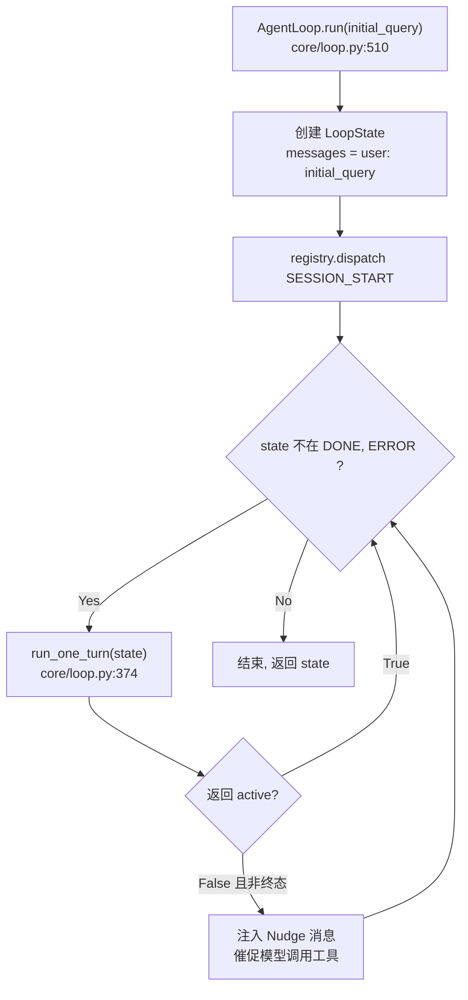
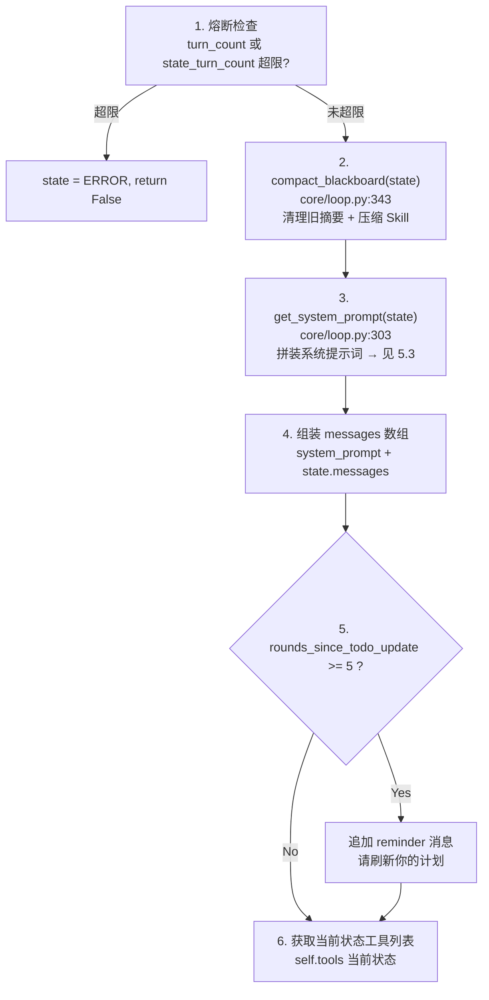
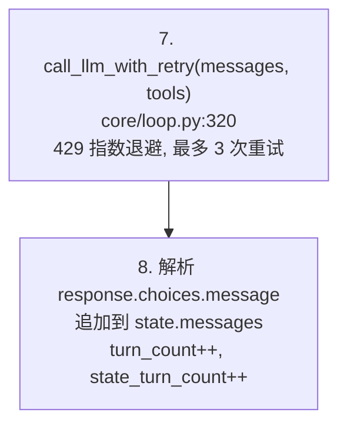
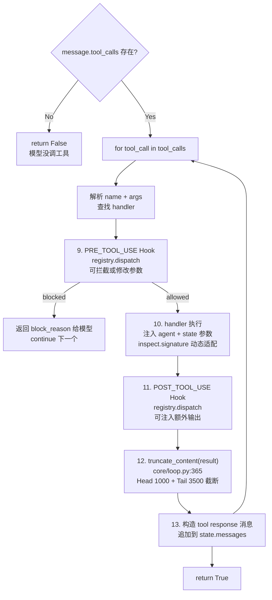
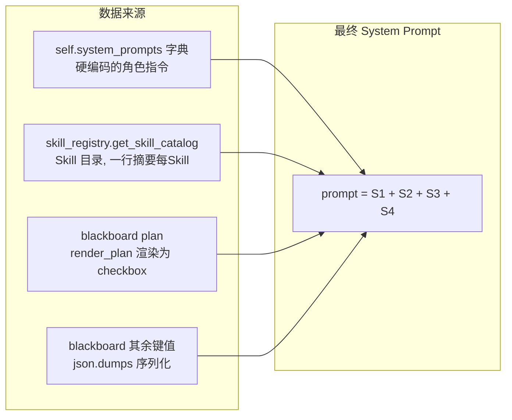
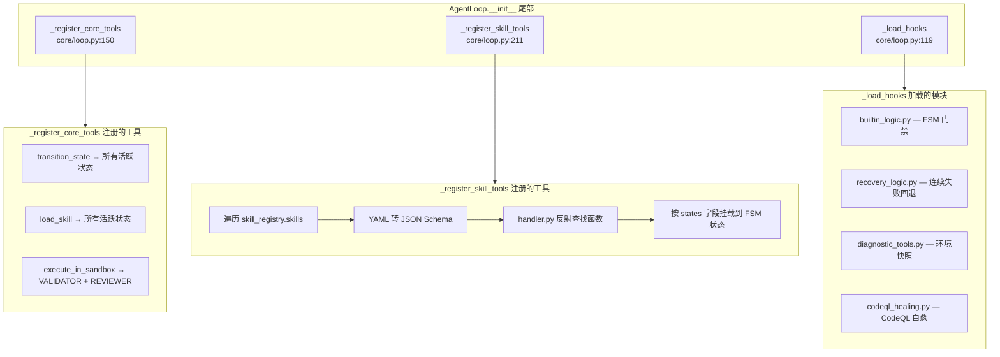

# 汇报文档：Sec-Agent-Harness 系统提示词 (System Prompt) 构建与消息流分析

## 1. 核心架构：Prompt 流水线 (Prompt Pipeline)
Sec-Agent-Harness 的系统提示词并不是一个静态的字符串，而是一个**多层级组装的动态流水线**。这与 `learn-claude-code` (s10) 中倡导的"Prompt 并非一整块大字符串，而是一条可维护的组装流水线"理念高度契合。

### 1.1 组装逻辑 (`core/loop.py: get_system_prompt`)
系统提示词由以下四个部分按序拼接而成：
1.  **状态专属基座 (Base State Prompt)**：根据当前 FSM 状态 (`INITIAL_ANALYSIS`, `VALIDATOR`, `FIXER`, `REVIEWER`) 加载不同的身份设定和操作准则。
2.  **技能目录 (Skill Catalog)**：通过 `skill_registry` 注入所有可用技能的元数据（名称和描述），让模型了解可选能力。
3.  **动态执行计划 (Execution Plan)**：如果黑板 (`Blackboard`) 中存在任务清单，会以 `[>]` 标记当前正在进行的任务，确保护理一致性。
4.  **上下文记忆 (Blackboard Context)**：将黑板中的结构化数据（如分析结果、PoC 路径等）序列化为 JSON 注入。

## 2. 动态维护与上下文压实 (Context Compaction)
为了防止 System Prompt 随着对话轮次增加而爆炸，系统引入了**自动压实机制** (`compact_blackboard`)：
-   **过期摘要清理**：自动移除不再属于当前状态的旧摘要 (Summary)。
-   **详情折叠**：当黑板总长度超过阈值时，自动将已加载的技能正文 (`loaded_skill_`) 替换为简化的占位符，提示模型按需重新加载。

## 3. 核心对比：Sec-Agent-Harness vs. Learn-Claude-Code

| 特性 | Sec-Agent-Harness 实现 | Learn-Claude-Code 建议 (s10/s10a) | 差异与优势 |
| :--- | :--- | :--- | :--- |
| **组装模式** | 基于字典与字符串拼接的 `get_system_prompt` 方法 | 结构化的 `SystemPromptBuilder` 类 | Harness 实现更轻量，s10 建议更具扩展性。 |
| **长期/短期隔离** | 通过 `Blackboard` 隔离状态；通过 `<reminder>` 注入临时提醒 | 区分 `System Prompt Blocks` 与 `System Reminder` | 两者思路一致。Harness 使用 `<reminder>` 解决模型"遗忘计划"的问题。 |
| **技能注入** | 目录摘要 (Catalog) + 按需加载 (Load Skill) | Skills 元信息 + 可选能力包 | Harness 的双层模式更适应安全分析这类知识密集型任务。 |
| **消息规范化** | 直接使用 OpenAI 消息格式，依靠 Hook 介入 | 独立的 `Normalized Message` 管道 | s10a 的设计更强调跨平台/格式的统一，Harness 目前深度绑定 OpenAI 协议。 |

## 4. 关键改进点与建议 (Insight)
1.  **退出准则 (Exit Criteria) 的强化**：在 `REVIEWER` 状态中，Prompt 已被硬编码为禁止未修复漏洞即进入 `DONE`。这是一种典型的 **Prompt Guardrail**。
2.  **去重与压实 (De-duplication and Compaction)**：
    当前的 `tool_result` 构建逻辑引入了 `truncate_content` 截断机制，保留头部 1000 字符和尾部 3500 字符，有效解决了庞大日志导致的上下文爆炸问题。
3.  **计划漂移感知 (Planning Mismatch)**：系统会在 Prompt 中对比当前状态与计划描述，通过外部 Hook 或逻辑发现不一致时，会主动注入警告，强制模型回归正轨。

---

## 5. 消息流管道架构 (Message Pipeline Architecture)

在 `sec-agent-harness` 中，最终发送给 LLM 的 Payload 是通过一条清晰的消息管道构建的。以下是**基于真实代码**的函数级调用流程。

### 5.1 全局生命周期：`run()` → `run_one_turn()` 循环



### 5.2 单轮核心：`run_one_turn()` 内部完整流程

这是系统最核心的函数，每一轮 LLM 调用的全部逻辑都在这里。按三个阶段展开：

#### Phase 1: 上下文准备



#### Phase 2: LLM 调用



#### Phase 3: 工具执行循环



### 5.3 `get_system_prompt()` 拼装详解

这个函数负责把多个来源的信息组装成一条完整的 System Prompt。



**对应代码（`core/loop.py:303-318`）**：

```python
def get_system_prompt(self, state: LoopState) -> str:
    # ① 基座：根据 FSM 状态选择角色指令
    prompt = self.system_prompts.get(state.current_state, "You are a security agent.")

    # ② 目录：注入 Skill Catalog（一行摘要/每个 Skill）
    prompt += f"\n\n{self.skill_registry.get_skill_catalog()}"

    if state.blackboard:
        # ③ 计划：渲染执行计划为 checkbox 格式
        plan = state.blackboard.get("plan", [])
        if plan:
            from core.utils import render_plan
            prompt += f"\n\n### Current Execution Plan\n{render_plan(plan)}"

        # ④ 上下文：黑板其余数据序列化注入
        filtered_bb = {k: v for k, v in state.blackboard.items() if k != "plan"}
        if filtered_bb:
            prompt += f"\n\n### Blackboard (State Context)\n{json.dumps(filtered_bb, indent=2)}"

    return prompt
```

### 5.4 初始化阶段：工具注册的完整链路

在 `AgentLoop.__init__()` 末尾，系统通过三个注册函数完成全部准备工作：



### 5.5 最终发送给 LLM 的 Payload 结构

```
┌─────────────────────────────────────────────────────────────────┐
│  OpenAI API 调用参数                                             │
├──────────────┬──────────────────────────────────────────────────┤
│  model       │  self.model（如 "gpt-4o"）                       │
├──────────────┼──────────────────────────────────────────────────┤
│              │  [0] {role: "system",  content: get_system_prompt()}│
│              │      ├─ 角色指令（硬编码，~200 tokens）             │
│              │      ├─ Skill 目录（动态，~100 tokens）            │
│              │      ├─ 执行计划（动态，render_plan()）            │
│              │      └─ 黑板数据（动态，json.dumps）               │
│  messages    │  [1] {role: "user",    content: initial_query}    │
│              │  [2] {role: "assistant", tool_calls: [...]}       │
│              │  [3] {role: "tool",    content: 截断后的输出}       │
│              │  ...                                              │
│              │  [N] {role: "system",  content: <reminder>}  可选  │
├──────────────┼──────────────────────────────────────────────────┤
│  tools       │  self.tools[current_state]                       │
│              │  （当前 FSM 状态允许的 JSON Schema 数组）           │
├──────────────┼──────────────────────────────────────────────────┤
│  tool_choice │  "auto"                                          │
└──────────────┴──────────────────────────────────────────────────┘
```

---

## 6. 具体场景演练：当 PoC 验证失败时

假设 Agent 正处于 `VALIDATOR` 状态，尝试运行一个刚编写的漏洞验证脚本 `poc.py`，但由于路径错误导致失败。系统会通过 POST_TOOL_USE Hook 注入诊断建议，并根据轮次触发 Reminder 强制模型检查计划，最终实现"自我纠偏"。

## 7. 未来演进：自进化热更新钩子 (Self-Evolving & Hot-Reloadable Hooks)

这是一个创新的 **Neural-Symbolic（神经-符号）** 闭环设计，旨在让 Agent 具备持续学习和瞬间自愈的能力。

### 7.1 自进化闭环逻辑
1.  **捕获成功路径**：当 Agent 经历报错但最终成功修复时，系统自动提取"错误模式 -> 解决方案"对。
2.  **规则提炼 (Neural)**：使用子模型将该模式提炼为正则表达式和简短的 `[SYSTEM ADVICE]`，并持久化到 `healing_rules.json`。
3.  **符号化执行 (Symbolic)**：下一次遇到相同错误时，Hook 系统会**瞬间匹配规则**并注入建议，无需主 Agent 再次消耗 Token 进行慢思考。

### 7.2 热更新 (Hot Reloading) 特性
-   **轮次感知 (Turn-aware)**：Hook 在每一轮运行前检查 `healing_rules.json` 的修改时间。如果规则库已更新，则在当前会话中**立即加载并生效**。
-   **无需重启**：Agent 可以在长周期的漏洞验证任务中"边学边用"，前一个子任务积累的避坑经验可以立刻应用于下一个子任务。
-   **群体进化**：多个并发任务可以通过共享同一个规则库，实现跨 Session 的经验共享。

---
*Generated by Gemini CLI as part of the system prompt audit task.*
